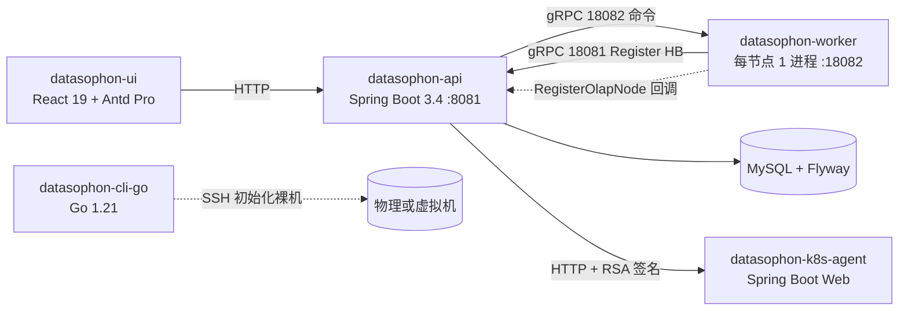

# Datasophon

> 大数据 / 云原生平台自动化部署与运维管理系统。
> 一键拉起 Hadoop / Spark / Flink / Hive / Doris / Kafka / Kubernetes 等 27+ 种内置服务,提供集群编排、配置下发、监控告警、可视化运维。

<p align="left">
  
  
  
  
  
  
</p>

---

## 一、能做什么

- **集群一键化**:UI 上画拓扑 → 自动选机器、推安装包、下配置、拉起服务,失败可断点重试。
- **节点初始化**:CLI 工具 `datasophon-cli` 把裸机/虚拟机准备好(JDK、Docker、K8s 基础、镜像仓库、MySQL、NTP …)。
- **多形态集群**:同时支持 Hadoop 物理集群与 Kubernetes 集群,共用同一套元数据驱动模型。
- **服务编排**:DAG + 角色策略,对外表现为"安装/启动/停止/重启/重配"等高层动作。
- **可视化运维**:服务实例与角色实例视图、配置编辑(Monaco)、DAG/拓扑可视化(AntV X6/G6)、告警历史、日志查询、Grafana 代理。
- **元数据驱动**:每种服务只需一份 `service_ddl.json` + 一个 Worker 端策略类,扩展新服务成本低。

---

## 二、架构鸟瞰



| 模块 | 角色 | 进程/产物 | 端口 |
|---|---|---|---|
| `datasophon-api` | Master 主服务,集群编排核心 | Spring Boot 进程 | HTTP `8081` (`/ddh`) + gRPC `18081` |
| `datasophon-worker` | Worker 节点进程,本地执行 | 每节点 1 个 main 进程 | gRPC `18082` |
| `datasophon-grpc-api` | gRPC proto stub | 库 | — |
| `datasophon-common` | 公共库(K8s 客户端、命令模型、Nexus 客户端) | 库 | — |
| `datasophon-cli-go` | 节点初始化 CLI(Go 重写) | 单二进制 `datasophon-cli` | — |
| `datasophon-k8s-agent` | K8s 内 Agent,签名鉴权远端执行 | Spring Boot Web Pod | 可配置 |
| `datasophon-ui` | 前端 | 静态资源(内嵌至 API 包) | — |

> 设计与各模块详细职责请见 **[ARCHITECTURE.md](./ARCHITECTURE.md)**。

---

## 三、技术栈

| 层 | 技术 |
|---|---|
| Master / Worker / K8s Agent | **Java 21**、**Spring Boot 3.4.5**、MyBatis-Plus 3.5.9、Druid、Flyway 9 |
| 跨进程通信 | **gRPC 1.68.1 / Protobuf 3.25.5**(grpc-spring-boot-starter 3.1.0,yidongnan/grpc-ecosystem) |
| 数据库 | MySQL 8(`mysql-connector 8.2.0`),迁移 1.1.0 → 2.1.0 |
| 任务编排 | 自实现 `RepoDAG` + `@Async masterExecutor` + `@Scheduled` 周期巡检 |
| K8s 集成 | fabric8-kubernetes-client + Helm |
| CLI | **Go 1.21**、Cobra、`golang.org/x/crypto/ssh` + `sftp` |
| 前端 | **React 19**、Ant Design 6、**Ant Design Pro 2.8.10**、Vite、pnpm,AntV X6/G6/Dagre,Monaco + Shiki |

---

## 四、快速开始

### 4.1 环境准备

| 工具 | 推荐版本 |
|---|---|
| JDK | JDK 21(JBR 21 / Microsoft OpenJDK 21) |
| Maven | 使用项目自带 `./mvnw` (3.8.4) |
| Node | 20.x(`frontend-maven-plugin` 自动下载,无需本机安装) |
| Go | 1.21+(仅在编译 CLI 时需要) |
| MySQL | 8.0+ |

### 4.2 全量构建

```bash
# 设置 JDK 21（必要 — 项目对 JDK 21 + Lombok 有强依赖）
export JAVA_HOME=/path/to/jdk-21

# 全量构建（编译 + 打包 + 内嵌前端）
./mvnw clean package -DskipTests

# 仅后端
./mvnw clean package -DskipTests -pl datasophon-api -am

# 仅前端
cd datasophon-ui && pnpm install && pnpm build

# 单元测试
./mvnw test

# 代码格式化
./mvnw spotless:apply
```

> 若是国内网络,建议先准备好 Maven `settings.xml` 镜像,避免 Maven Central 直连失败。

### 4.3 编译 CLI(可选)

```bash
cd datasophon-cli-go
# 当前平台
go build -o dist/datasophon-cli ./cmd/datasophon-cli

# 跨平台交叉编译
GOOS=linux GOARCH=amd64 go build -o dist/datasophon-cli-linux-amd64  ./cmd/datasophon-cli
GOOS=linux GOARCH=arm64 go build -o dist/datasophon-cli-linux-arm64  ./cmd/datasophon-cli
```

### 4.4 运行

#### 方案 A:Docker(最快)

```bash
docker build -t datasophon/datasophon:dev .
docker run -d -p 8081:8081 --name datasophon datasophon/datasophon:dev
# 浏览器访问 http://host:8081/ddh,默认账号 admin / admin123
```

#### 方案 B:Docker Compose

```bash
cd deploy/compose
docker compose up -d
```

#### 方案 C:Kubernetes

```bash
# 见 deploy/k8s/ 中的 manifest
kubectl apply -f deploy/k8s/
```

#### 方案 D:裸机

```bash
# Master
tar -xzf datasophon-api/target/datasophon-manager-3.0-SNAPSHOT.tar.gz
./bin/start-api.sh

# Worker(每节点一个)
./bin/start-worker.sh
```

详细部署文档:[deploy/Deployment.md](./deploy/Deployment.md)

### 4.5 节点初始化(CLI)

```bash
# 必需环境变量
export DDH_HOME=/opt/datasophon

# 单步操作:防火墙关闭、JDK 17 安装、MySQL 启动 …
datasophon-cli init firewall
datasophon-cli init jdk17
datasophon-cli init mysql

# 一键 33 步全量初始化(plan → 确认 → apply)
datasophon-cli create cluster -t hadoop

# 仅生成计划,不执行
datasophon-cli create cluster -t kubernetes --plan-only

# 失败后从断点继续
datasophon-cli create cluster apply -t kubernetes

# 全局 --dry-run,只打印命令不实际执行
datasophon-cli init mysql --dry-run
```

CLI 完整命令参考:[datasophon-cli-go/docs](./datasophon-cli-go/docs/)

---

## 五、目录结构

```
datasophon/
├── datasophon-api/          # Master 主服务 (Spring Boot 3.4)
│   └── src/main/resources/
│       ├── application.yml          # 主配置
│       ├── db/migration/            # Flyway 1.1 → 2.1
│       ├── mapper/*.xml             # MyBatis XML
│       └── meta/datacluster/        # ⭐ 服务元数据 (HDFS, Doris, Kafka, …)
├── datasophon-worker/       # Worker 节点进程
├── datasophon-grpc-api/     # gRPC proto + stub
│   └── src/main/proto/      #   registry / worker / master / common
├── datasophon-common/       # 公共库 (K8s 客户端、命令模型)
├── datasophon-cli-go/       # ⭐ Go 重写的节点初始化 CLI (替代 datasophon-cli)
├── datasophon-cli/          # Java CLI (历史遗留,逐步淘汰)
├── datasophon-k8s-agent/    # K8s 内 Agent (RSA 签名鉴权)
├── datasophon-ui/           # React 19 + Antd Pro 前端
├── deploy/
│   ├── compose/             # Docker Compose
│   ├── docker/              # Dockerfile + 入口脚本
│   ├── k8s/                 # K8s manifest
│   └── Deployment.md
├── ARCHITECTURE.md          # ⭐ 架构文档(本 README 的延伸阅读)
└── README.md
```

---

## 六、内置服务列表

`datasophon-api/src/main/resources/meta/datacluster/` 内置以下服务定义,可在 UI 直接安装:

| 类别 | 服务 |
|---|---|
| 存储 | HDFS、MinIO、JuiceFS、Elasticsearch |
| 计算 | YARN、Spark 3、Flink、Hive、Kyuubi |
| OLAP | Doris、StarRocks(via Doris 兼容) |
| 消息/调度 | Kafka、Zookeeper、ETCD、Nacos、USCHEDULER |
| 监控 | Prometheus、Grafana、AlertManager、Loki、Promtail |
| 数据应用 | DATART、APISIX、Nginx、Redis、Amoro |

新增服务只需:
1. 编写 `meta/datacluster/<NAME>/service_ddl.json`(参数、模板、角色拓扑、告警)
2. 在 `datasophon-worker/strategy/` 实现一个 `*HandlerStrategy` 类
3. UI 自动渲染表单,无需改动

---

## 七、默认账号 / 端口

| 项 | 值 |
|---|---|
| 默认账号 | `admin` / `admin123` |
| API HTTP | `8081`(上下文路径 `/ddh`) |
| Master gRPC | `18081` |
| Worker gRPC | `18082` |
| MySQL | `3306`(可配置) |

---

## 八、文档

| 文档 | 用途 |
|---|---|
| **[ARCHITECTURE.md](./ARCHITECTURE.md)** | 系统架构、设计权衡、关键文件速查 |
| [deploy/Deployment.md](./deploy/Deployment.md) | 部署细节(裸机/Docker/K8s) |
| [docs/](./docs/) | 历史文档与中文操作指南 |
| [datasophon-cli-go/docs/](./datasophon-cli-go/docs/) | CLI 命令参考 |
| [.claude/rules/project-structure.md](./.claude/rules/project-structure.md) | 完整工程结构索引(供 AI 工具与新人查阅) |

---

## 九、贡献

1. Fork 仓库,基于 `dev`(或当前活跃分支)新建 feature 分支。
2. 提交前运行:
   ```bash
   ./mvnw spotless:apply         # 后端格式化
   ./mvnw test                    # 单元测试
   cd datasophon-ui && pnpm lint  # 前端 lint
   ```
3. 提交信息遵循 [Conventional Commits](https://www.conventionalcommits.org/)。
4. 创建 PR 并描述动机、改动范围、测试方式。

---

## 十、License

源自 Datasophon 开源项目,沿用上游 License(详见 `LICENSE` 与 `NOTICE`)。
本仓库为定制分支,在原始版本上做了 gRPC 替代 Pekko、CLI Go 重写、Spring Boot 3 升级等改造。
