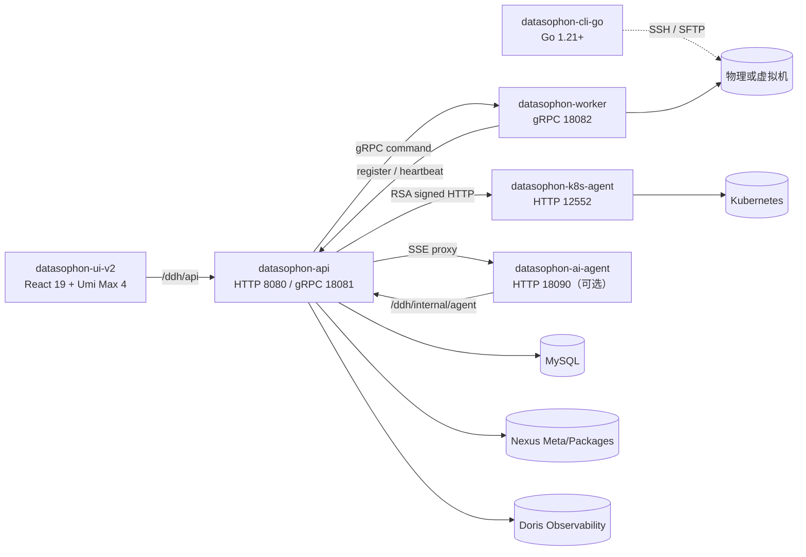

# Datasophon

> 大数据与云原生平台的自动化部署、接管、运维和可观测管理系统。

Datasophon 通过“Master 控制面 + Worker/Agent 工作面”管理物理机和 Kubernetes 集群，提供节点初始化、服务编排、配置下发、启停升级、监控告警、日志/Trace 查询、血缘展示和只读接管等能力。当前开发版本为 `3.0-SNAPSHOT`。

<p align="left">
  
  
  
  
  
  
</p>

## 核心能力

- **物理集群编排**：按服务元数据和 DAG 完成主机接入、安装、配置、启停、重启、升级与状态巡检。
- **Kubernetes 管理**：支持托管集群部署，也支持以 `IMPORTED` 模式接管已有集群做只读扫描和监控；写操作在客户端入口统一封锁。
- **节点初始化 CLI**：`datasophon-cli` 以 plan/apply 两阶段完成裸机初始化、基础组件安装、Nexus 上传和断点续跑。
- **元数据驱动**：物理服务使用 `service_ddl.json`，K8s 产品使用 `manifest.yaml`；元数据与模板通过 Nexus 分发，可通过内部接口热加载。
- **可观测与告警**：OpenTelemetry Collector 将 metrics、logs、traces 写入 Doris，并为平台、节点和服务提供监控看板与告警。
- **数据血缘**：代理 Gravitino 血缘接口，展示实时和历史血缘图、作业流速及数据集变更。
- **AI 运维助手（可选）**：独立 Node.js sidecar 通过内部只读 API 查询集群、主机和服务，并以 SSE 对接前端。

## 架构


```mermaid
flowchart LR
    UI["datasophon-ui-v2<br/>React 19 + Umi Max 4"]
    CLI["datasophon-cli-go<br/>Go 1.21+"]
    API["datasophon-api<br/>HTTP 8080 / gRPC 18081"]
    Worker["datasophon-worker<br/>gRPC 18082"]
    Agent["datasophon-k8s-agent<br/>HTTP 12552"]
    AI["datasophon-ai-agent<br/>HTTP 18090（可选）"]
    MySQL[(MySQL)]
    Nexus[(Nexus Meta/Packages)]
    Doris[(Doris Observability)]
    Hosts[(物理或虚拟机)]
    K8s[(Kubernetes)]

    UI -->|/ddh/api| API
    CLI -.->|SSH / SFTP| Hosts
    API --> MySQL
    API --> Nexus
    API --> Doris
    API -->|gRPC command| Worker
    Worker -->|register / heartbeat| API
    Worker --> Hosts
    API -->|RSA signed HTTP| Agent
    Agent --> K8s
    API -->|SSE proxy| AI
    AI -->|/ddh/internal/agent| API
```

| 模块 | 职责 | 运行形态 / 产物 | 默认端口 |
|---|---|---|---|
| `datasophon-api` | Master、REST API、DAG 编排、监控与血缘查询 | Spring Boot；`datasophon-manager-<version>.tar.gz` | HTTP `8080`、gRPC `18081` |
| `datasophon-worker` | 在受管节点执行服务生命周期与资源操作 | 非 Spring Boot Java 进程；`datasophon-worker.tar.gz` | gRPC `18082`、JMX exporter `8585` |
| `datasophon-grpc-api` | Master/Worker gRPC proto 与 checked-in stub | Java 库 | — |
| `datasophon-common` | 公共命令模型、K8s/Nexus 客户端和工具 | Java 库 | — |
| `datasophon-cli-go` | 节点初始化、基础设施安装和制品上传 | `datasophon-cli` 单二进制 | — |
| `datasophon-ui-v2` | 当前默认 Web 前端 | Umi Max 静态资源，内嵌到 Manager 包 | 开发端口 `8000` |
| `datasophon-k8s-agent` | 集群内签名鉴权执行边界 | Spring Boot Pod、Docker 镜像和 Helm Chart | HTTP `12552`，默认 NodePort `32552` |
| `datasophon-assembly` | 汇总 Manager、Worker 和 CLI 交付物 | `datasophon-<version>-package.tar.gz` | — |
| `datasophon-flink-metrics-otel` | 将 Flink 1.20.x 指标通过 OTLP/gRPC 导出到 OTel Collector | Flink metrics plugin shaded jar | — |

`datasophon-ai-agent`、`datasophon-lineage-emitter` 和 `datasophon-flink-metrics-otel` 是独立工程，不在根 Maven reactor 中。详细设计见 [系统架构文档](./docs/ARCHITECTURE.md)。

## 技术栈

| 层 | 当前实现 |
|---|---|
| Master / Agent | Java 21、Spring Boot 3.4.5、Jetty、MyBatis-Plus 3.5.9、Druid 1.2.24 |
| Worker | Java 21、gRPC Netty、Jackson、Freemarker；纯 `main()` 进程 |
| 跨进程通信 | gRPC 1.68.1、Protobuf 3.25.5 |
| 数据库 | MySQL 8；`DatabaseMigration` 自研迁移器（不是 Flyway） |
| Kubernetes | fabric8 kubernetes-client、kubectl、Helm |
| CLI | Go 1.21+、Cobra、Viper、SSH/SFTP |
| 前端 | React 19.2、Umi Max 4、Ant Design 6、ProComponents 3、AntV、Monaco、Ant Design X |
| 可观测 | OpenTelemetry Collector/Java Agent、Doris、Prometheus 兼容采集 |

## 快速开始

### 环境要求

| 工具 | 要求 |
|---|---|
| JDK | 21 |
| Maven | 使用仓库自带 `./mvnw`（3.8.4） |
| Node.js | `>=22`；Maven 前端构建固定 Node `22.14.0` / npm `10.9.2` |
| Go | `1.21+`（仅构建 CLI 时需要） |
| MySQL | 8.0+ |

### 构建

```bash
# 全量构建：包含 UI、API、Worker、CLI、K8s Agent 和最终 assembly
export JAVA_HOME=/path/to/jdk-21
./mvnw clean package -DskipTests

# API 及其依赖；跳过前端 npm 安装和构建
./mvnw -pl datasophon-common,datasophon-grpc-api,datasophon-ui-v2,datasophon-api \
  -Dskip.installnodenpm -Dskip.npm -DskipTests package

# 单元测试
./mvnw test

# Java 格式检查/修复
./mvnw spotless:apply
```

国内网络环境可追加 `-Pgoogle-mirror`，或使用本地 Maven `settings.xml`。

前端独立开发：

```bash
cd datasophon-ui-v2
npm install
npm start        # 启用 mock
npm run dev      # 不启用 mock，连接后端代理
npm run lint
npm run test
npm run build
```

CLI 独立构建：

```bash
cd datasophon-cli-go
make build       # dist/datasophon-cli
make release     # linux/darwin × amd64/arm64
make test
make vet
```

### Docker Compose 本地环境

先完成 API/Worker 打包，再启动基础联调环境：

```bash
./mvnw clean package -DskipTests
docker compose -f deploy/compose/docker-compose.yml up --build
```

访问 <http://127.0.0.1:8080/ddh>。更完整的 K8s、Standalone 和可观测环境见 [Compose 使用说明](./deploy/compose/README.md)。

### 默认账号与端口

| 项目 | 默认值 |
|---|---|
| Web 登录 | `admin` / `DJEutbydS@U%f7Jb` |
| API HTTP | `8080`，上下文 `/ddh` |
| Master gRPC | `18081` |
| Worker gRPC | `18082` |
| K8s Agent HTTP | `12552` |
| AI Agent HTTP | `18090` |
| MySQL | `3306` |

默认凭据仅用于初始化和本地验证，生产部署后应立即替换。

## CLI 节点初始化

`DDH_HOME` 是必填环境变量，计划、状态和运行资源都从该目录派生。

```bash
export DDH_HOME=/opt/datasophon

# 生成配置（create cluster 固定读取该路径）
mkdir -p "$DDH_HOME/datasophon-init/config"
datasophon-cli create config -t hadoop \
  -o "$DDH_HOME/datasophon-init/config/cluster-sample.yml"

# 生成 37 步集群初始化计划，不执行
datasophon-cli create cluster plan -t hadoop \
  -p "$DDH_HOME" \
  --installPath /opt/install \
  --productPackagesPath /data/install_datasophon/package

# 校验配置 hash 后执行，失败可再次 apply 断点续跑
datasophon-cli create cluster apply -t hadoop \
  -p "$DDH_HOME" \
  --installPath /opt/install \
  --productPackagesPath /data/install_datasophon/package

# 单步本地初始化
datasophon-cli init jdk21

# 只打印命令
datasophon-cli --dry-run init jdk21
```

完整说明见 [CLI 运维手册](./datasophon-cli-go/docs/README.md)。

## 元数据与内置产品

运行期元数据位于 `package/raw/meta/`，通过 Nexus raw 仓库分发：

- `datacluster-physical/`：19 个物理服务 `service_ddl.json`，包含角色、依赖、参数、脚本、模板、告警与安装包信息。
- `datacluster-k8s/`：17 个 K8s 产品 `manifest.yaml`，覆盖 Helm、Operator/CR 与普通工作负载等形态。

新增或升级物理服务时，需要同步服务 DDL、模板/脚本、Worker 特殊策略（如有）及 `package/manifest.json`；K8s 产品以对应目录的 `manifest.yaml` 为事实源。

## 目录结构

```text
datasophon/
├── datasophon-api/                 # Master REST/gRPC 服务
├── datasophon-worker/              # 节点 Worker
├── datasophon-grpc-api/            # gRPC 契约与 stub
├── datasophon-common/              # 公共库
├── datasophon-cli-go/              # Go CLI
├── datasophon-ui-v2/               # 当前默认前端
├── datasophon-k8s-agent/           # K8s 内 Agent
├── datasophon-assembly/            # 最终交付包
├── datasophon-ai-agent/            # 可选 AI sidecar（独立 Node 工程）
├── datasophon-lineage-emitter/      # 独立 Flink lineage emitter
├── datasophon-flink-metrics-otel/   # Flink 1.20.x OTLP metrics plugin
├── package/                         # 安装包清单与运行期元数据
├── deploy/                          # Compose、Docker、K8s 部署资产
└── docs/                            # 架构、OpenAPI、血缘及实施文档
```

旧 `datasophon-ui/` 已退出默认构建，仅保留历史参考；新前端工作统一在 `datasophon-ui-v2/` 完成。

## 文档

| 文档 | 用途 |
|---|---|
| [系统架构](./docs/ARCHITECTURE.md) | 模块边界、协议、调用链和关键文件 |
| [CLI 运维手册](./datasophon-cli-go/docs/README.md) | plan/apply、命令树、配置与恢复 |
| [UI v2](./datasophon-ui-v2/README.md) | 前端能力、开发、测试和约束 |
| [Compose 环境](./deploy/compose/README.md) | 基础、K8s、Standalone 和可观测环境 |
| [REST API 契约](./docs/openapi/README.md) | 静态契约范围与动态 springdoc |
| [内部 API](./docs/internal-api/README.md) | 元数据热加载与 AI Agent 回调 |
| [部署包管理](./package/README.md) | 清单、下载、校验与 Nexus 目录布局 |

## 贡献

1. 基于 `dev` 或当前活跃分支创建功能分支。
2. Java 改动运行相关 Maven 测试和 Spotless；前端改动在 `datasophon-ui-v2` 运行 `npm run lint`、`npm run test` 和必要的构建；CLI 改动运行 `make test && make vet`。
3. 提交信息遵循 [Conventional Commits](https://www.conventionalcommits.org/)。
4. PR 中说明动机、改动范围、验证证据和已知限制。

## License

本项目沿用仓库中的 [LICENSE](./LICENSE) 与 [NOTICE](./NOTICE)。
