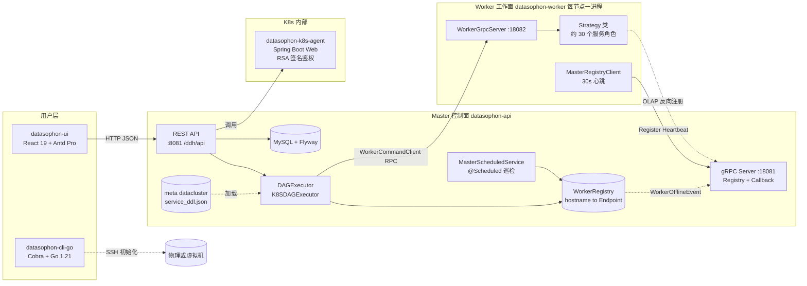
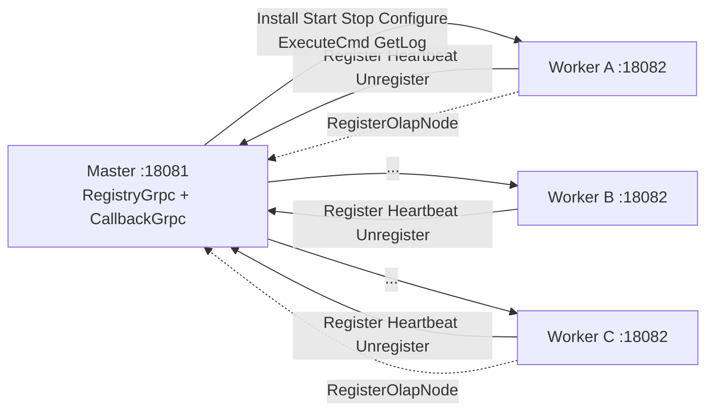
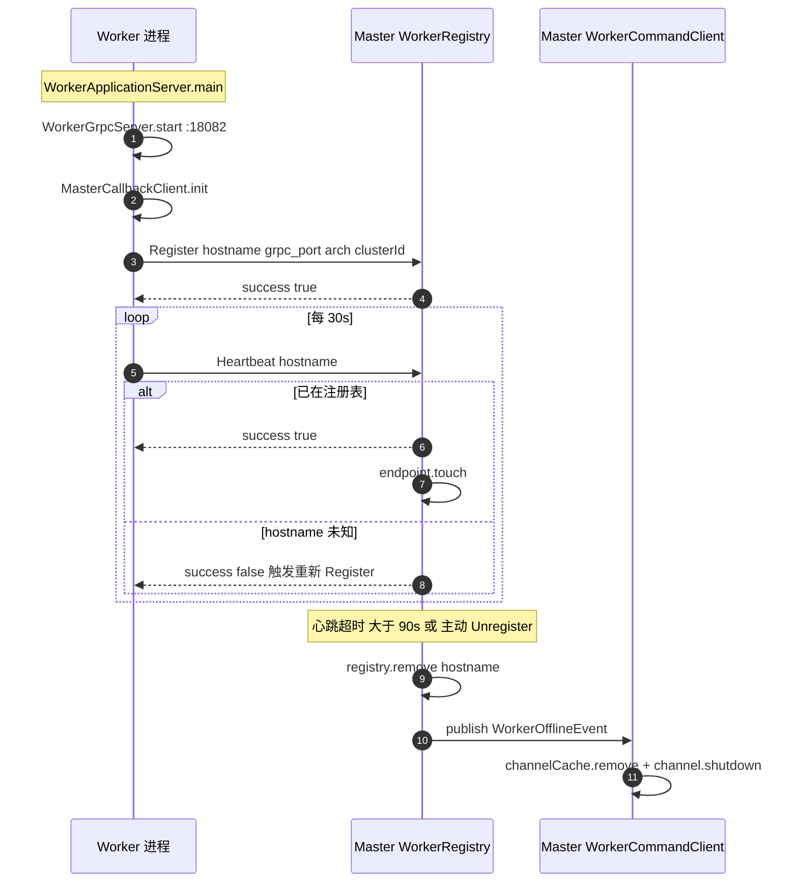
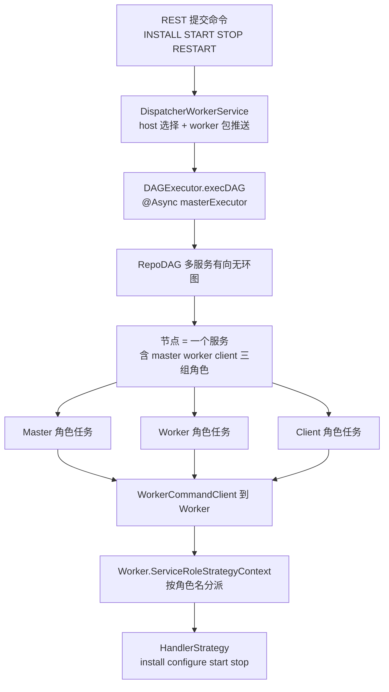
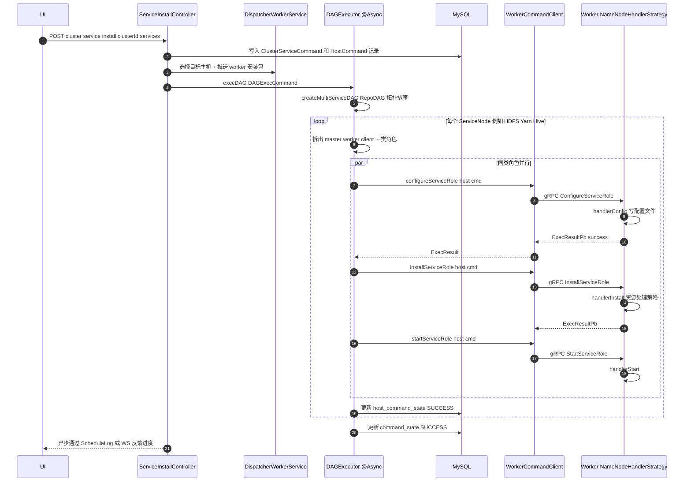
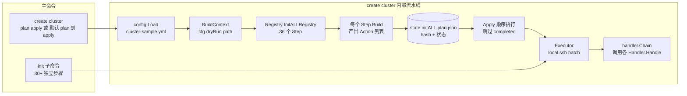
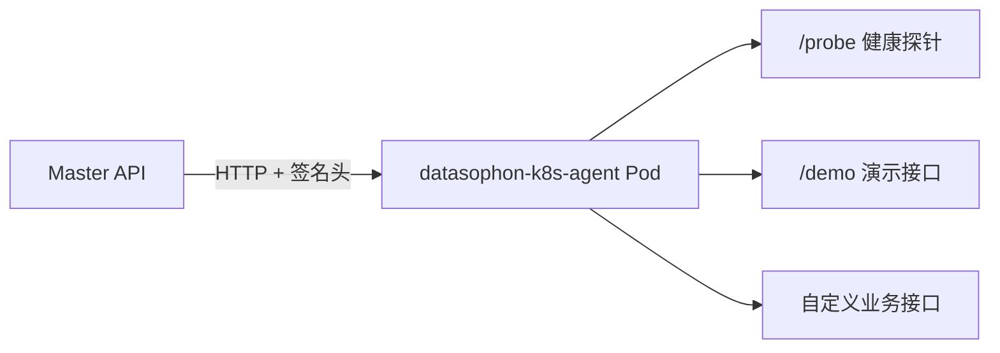
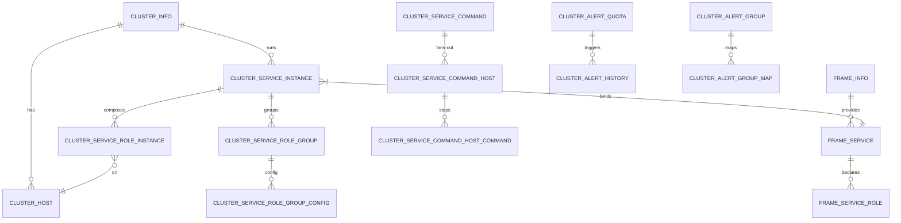
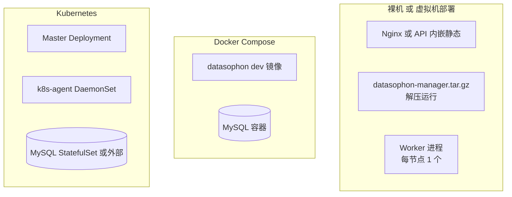

# Datasophon 架构文档

> 面向研发与运维工程师的整体架构说明。
> 适用版本:`3.0-SNAPSHOT`（2026 年 Pekko 全量移除后的形态)。
> 文档对应代码分支：`refactor/cluster-type`。

---

## 1. 项目定位

Datasophon 是一个**大数据/云原生平台部署与运维管理系统**,目标是在一组裸机或虚拟机上,以"控制面 + 工作面"的方式,自动完成:

- 节点初始化(防火墙、JDK、Docker、Kubernetes 基础环境、镜像仓库、MySQL/NTP/RustFS 等基础设施)
- 大数据/云原生服务部署(Hadoop、Spark、Flink、Hive、Doris、Kafka、Zookeeper、Kubernetes 工作负载等 27+ 个内置服务)
- 服务的启停、配置下发、健康巡检、告警、日志聚合
- 集群级 DAG 编排与变更管理

它通过一组**声明式服务元数据**(`meta/datacluster/<SERVICE>/service_ddl.json`)驱动安装策略,从而做到「新增一种服务 ≈ 写一份 DDL + 一个策略类」。

---

## 2. 顶层架构



### 关键边界

|           接口 / 边界           |           协议            |                       用途                        |
|-----------------------------|-------------------------|-------------------------------------------------|
| UI → API                    | HTTP/JSON,`/ddh/api/**` | 用户操作入口                                          |
| Master gRPC Server `:18081` | gRPC                    | 接收 Worker 注册/心跳;接收 Worker 的 OLAP 反向回调           |
| Worker gRPC Server `:18082` | gRPC                    | 接收 Master 的命令(Install/Start/Stop/Configure/...) |
| Worker → Master 心跳          | 30s 间隔,超过 90s 视为离线      | 注册表中心化维护 Worker 列表                              |
| API → K8s Agent             | HTTP + RSA 签名           | 触发 Pod 内 K8s 操作(Helm/kubectl)                   |
| Master/Worker → DB          | MyBatis-Plus,Druid 池    | 唯一真源,Flyway 升级                                  |

---

## 3. 模块拓扑

### 3.1 Maven 模块矩阵

|           模块           |             角色             |          运行形态           |              端口              |                     主要技术栈                     |
|------------------------|----------------------------|-------------------------|------------------------------|-----------------------------------------------|
| `datasophon-api`       | Master 主服务                 | Spring Boot 进程          | HTTP 8081(`/ddh`)、gRPC 18081 | Spring Boot 3.4.5、MyBatis-Plus 3.5.9、Flyway 9 |
| `datasophon-worker`    | Worker 节点进程                | 每节点 1 进程,纯 main         | gRPC 18082                   | grpc-java 1.68.1、Hutool 5.8.40                |
| `datasophon-grpc-api`  | gRPC 共享 stub               | 库,无进程                   | —                            | protobuf 3.25.5(stub 已 checked-in)            |
| `datasophon-common`    | 公共库(K8s 客户端、模型、命令消息、Nexus) | 库,无进程                   | —                            | fabric8 K8s client、fastjson2、Jackson          |
| `datasophon-cli-go`    | 节点初始化 CLI                  | Go 二进制 `datasophon-cli` | —                            | Go 1.21、Cobra、`golang.org/x/crypto/ssh`       |
| `datasophon-k8s-agent` | K8s 内 Agent                | Spring Boot Web         | HTTP(可配置)                    | RSA 签名鉴权                                      |
| `datasophon-ui`        | 前端                         | 静态资源,Nginx/Spring 静态服务  | —                            | React 19、Antd 6、Antd Pro 2.8、Vite、pnpm        |
| `datasophon-cli`(Java) | **历史遗留**,逐步被 `cli-go` 替代   | 命令行                     | —                            | 仅用于兼容                                         |

> ⚠️ **Pekko(原 Akka)已于 2026-05-23 完全移除**(commit `d0b93b09`)。Master↔Worker 跨进程通信改为 gRPC,Master 内部本地调度改为 Spring `@Async` / `@Scheduled`。后文涉及"原 Actor"字样均为代码注释中的历史脚注,不再真实存在。

### 3.2 datasophon-api 包结构

```
com.datasophon
├── api/
│   ├── DataSophonApplicationServer    # @SpringBootApplication 主入口
│   ├── controller/                    # REST 控制器（~45 个）
│   │   ├── cluster/                   # 集群、K8s 配置
│   │   ├── cmd/                       # 命令、命令-主机映射
│   │   ├── extrepo/                   # 外部仓库（Nexus / 离线包）
│   │   ├── frame/                     # 框架元数据
│   │   ├── instance/                  # 服务实例 & 角色实例
│   │   └── log/                       # 操作日志
│   ├── service/                       # 业务服务（接口 + impl/）
│   ├── grpc/                          # ⭐ gRPC 层（Master 侧）
│   │   ├── WorkerCommandClient        # 向 Worker 发送命令
│   │   ├── WorkerRegistry             # 内存 hostname → WorkerEndpoint
│   │   ├── WorkerRegistryPrewarmer    # @PostConstruct 启动预热
│   │   ├── WorkerRegistryGrpcService  # 接收 Worker 注册/心跳
│   │   ├── MasterCallbackGrpcService  # 接收 Worker 反向回调
│   │   └── WorkerEndpoint / WorkerOfflineEvent
│   ├── master/                        # ⭐ 编排核心（替代原 Pekko Actor）
│   │   ├── DAGExecutor                # 物理集群 DAG 调度
│   │   ├── K8SDAGExecutor             # K8s 集群 DAG 调度
│   │   ├── MasterScheduledService     # @Scheduled 周期巡检
│   │   ├── handler/{host,service,k8s} # 编排步骤 Handler
│   │   ├── service/                   # HostCheckService 等领域服务
│   │   └── transport/                 # GrpcWorkerCallAdapter
│   ├── strategy/                      # Master 侧策略
│   ├── load/                          # ApplicationContext 持有 & 元数据加载
│   ├── security/                      # 登录鉴权
│   └── configuration/                 # Spring 配置 Bean
├── common/jackson                     # Jackson 序列化扩展
├── dao/                               # MyBatis-Plus DAO 层
│   ├── entity/{cluster,cmd,dag,frame,instance}
│   ├── mapper/                        # 接口 + XML
│   ├── vo/ enums/ model/ typehandler/
└── domain/                            # 轻量领域模型（host、alert）
```

### 3.3 datasophon-worker 包结构

```
com.datasophon.worker
├── WorkerApplicationServer            # main()
├── grpc/                              # ⭐
│   ├── WorkerGrpcServer               # Netty gRPC 服务端，有界线程池 max(8, 2×cores)
│   ├── WorkerCommandGrpcService       # 实现全部 WorkerCommand RPC
│   ├── MasterRegistryClient           # 注册 + 30s 心跳（单线程 Scheduler）
│   └── MasterCallbackClient           # 静态 Holder，策略类反向调用 Master
├── handler/                           # 安装处理器（HDFS/Kerberos/Yarn/…）
├── strategy/                          # ⭐ 服务角色策略（~30 个）
│   ├── ServiceRoleStrategy            # 接口
│   ├── ServiceRoleStrategyContext     # 按角色名分派
│   └── resource/                      # 资源处理：Download/ExecShell/Link/Replace/Nexus
├── hook/                              # 启动钩子（db / nacos / s3 / resource）
├── log/                               # 日志收集
└── utils/                             # UnixUtils 等
```

### 3.4 datasophon-grpc-api 模块

```
src/main/proto/
├── common.proto       # ExecResultPb（公共返回）
├── registry.proto     # WorkerRegistryService.{Register,Heartbeat,Unregister}
├── worker.proto       # WorkerCommandService.{Ping,Execute,Install,Start,Stop,...}
└── master.proto       # MasterCallbackService.RegisterOlapNode

src/main/java/com/datasophon/grpc/api/
├── GrpcConstants      # ⭐ 端口/心跳 SSOT
│   ├── MASTER_GRPC_PORT = 18081
│   ├── WORKER_GRPC_PORT = 18082
│   ├── HEARTBEAT_INTERVAL_SECONDS = 30
│   └── HEARTBEAT_TIMEOUT_SECONDS = 90
└── *.java             # protoc 产物（checked-in）
```

stub 已提交,日常 `./mvnw compile` 不必重新生成;只有 proto 改动时使用 `-Pgenerate-proto`。

---

## 4. 核心架构主题

### 4.1 控制面 ↔ 工作面 通信

#### 拓扑



- **Worker → Master**:`WorkerRegistryService`(注册/心跳/注销) + `MasterCallbackService`(OLAP 节点反向注册)。
- **Master → Worker**:`WorkerCommandService`,涵盖 Phase 1/2/3 全部命令。Channel 按 hostname 懒建并缓存。
- **端口共用**:Master 的两类服务共用 `:18081`,均挂在 `@GrpcService` 自动注册的 Netty Server 上。

#### 注册 + 心跳生命周期



#### Channel 泄漏防御(H1 修复)

`WorkerCommandClient` 通过 `@EventListener` 监听 `WorkerOfflineEvent`,在以下三种 Worker 离线场景下立即关闭对应 gRPC Channel,避免连接句柄泄漏:

1. Worker 主动 `Unregister`
2. Worker 重新注册(端口变更/重启)
3. `WorkerRegistry.getEndpoint` 检测到心跳超时

#### 启动预热(防重启窗口期,H3)

Master 重启后,`WorkerRegistryPrewarmer` 在 `@PostConstruct` 阶段从 DB 加载已知主机列表,以默认端口写入 `WorkerRegistry`(`preRegister`),给 Worker 90 秒窗口期完成第一次真实心跳并覆盖端点。期间 Master 仍可向 Worker 派发命令,避免"Master 重启 → 所有命令失败"。

### 4.2 服务编排:DAG + 策略

#### 编排两层结构



- **DAGExecutor**(`datasophon-api/master/DAGExecutor.java`)负责物理集群多服务的依赖编排,使用 `RepoDAG`(自实现的拓扑排序 + 任务调度器)。
- **K8SDAGExecutor** 负责 K8s 集群:节点动作改为 `kubectl apply` / Helm Chart 操作,通过 `datasophon-k8s-agent` 落地。
- **服务粒度**与**角色粒度**分两层:DAG 节点是服务(如 HDFS),节点内部串行 `master → worker → client` 三类角色;每个角色实例发到对应主机执行。

#### Worker 端策略

```
ServiceRoleStrategyContext
├── nameMatch: "NameNode"           → NameNodeHandlerStrategy
├── nameMatch: "DataNode"           → DataNodeHandlerStrategy
├── nameMatch: "ResourceManager"    → ResourceManagerHandlerStrategy
├── nameMatch: "FE"  (Doris)        → FEHandlerStrategy（含 MasterCallback 注册）
├── nameMatch: "BE"  (Doris)        → BEHandlerStrategy
└── ... (~30 个)
```

每个策略实现统一接口 `ServiceRoleStrategy`,生命周期方法包括:
- `handlerConfig` — 渲染并写入配置文件
- `handlerInstall` — 解压、链接、初始化(资源处理用 `strategy/resource/*`)
- `handlerStart` / `handlerStop` — 拉起/停止进程
- `getLog` — 暴露日志路径供 Master `GetLog` 拉取

### 4.3 服务元数据驱动

```
datasophon-api/src/main/resources/meta/datacluster/<SERVICE>/
├── service_ddl.json                  # ⭐ 一份 JSON 定义整个服务
│   ├── name / label / version
│   ├── runAs (user/group)
│   ├── parameters[]                  # 用户可配置项 → UI 自动渲染表单
│   ├── configWriter[]                # 模板 → 目标文件映射 + Generator
│   ├── roles[]                       # master/worker/client 各角色拓扑约束
│   └── prometheus / alert            # 监控、告警规则
├── alert/<role>.json                 # 告警阈值
├── conf/                             # 配置模板（FreeMarker）
└── icon.svg
```

- DDL 由 `datasophon-api/load` 包扫描入库到 `ds_frame_service_*` 表。
- UI 通过 `FrameInfoController` / `FrameServiceController` 拉取并渲染。
- DAG 调度时把 DDL 中的 `configWriter`、`roles` 等拼成 `GenerateServiceConfigCommand`、`InstallServiceRoleCommand`,经 gRPC 下发到 Worker。

### 4.4 服务安装时序(物理集群,以 HDFS 为例)



### 4.5 周期巡检与告警

`MasterScheduledService` 用 `@Scheduled` 替代原 Pekko `scheduleWithFixedDelay`,每个独立的 `try-catch` 防止一个异常打断后续巡检:

|    任务    | 初始延迟 |  频率  |                              实现                               |
|----------|------|------|---------------------------------------------------------------|
| 节点存活检测   | 30s  | 300s | `HostCheckService.checkHosts(null)`                           |
| 服务角色状态检测 | 15s  | 30s  | 遍历 `ClusterServiceRoleInstance`,通过 `serviceRoleStatus` RPC 查询 |
| 集群状态聚合   | 30s  | 60s  | `ClusterStatusService` 汇总角色状态 → 集群健康度                         |

告警链路:Worker 端的 `AlertConfigActor`(代码遗留命名)→ gRPC `GenerateAlertConfig` → Prometheus AlertManager → `ClusterAlertHistory`。

### 4.6 节点初始化:datasophon-cli-go

CLI-Go 取代旧 Java CLI,使用 Cobra 命令树 + 声明式 Step + 持久化 Plan 文件,支持 plan/apply 两阶段与断点续跑。



关键设计:
- **声明式 Step**:`Step{ID, Name, Scope, Condition, Build}`。`Scope` 区分 Hadoop / Kubernetes / Both,`Condition` 一律从 `cfg.*` 读(项目规则 [[feedback_cfg_enable_must_be_condition]])。
- **plan/apply 分离**:`plan` 写入 `state/initALL.plan.json`,`apply` 读取并执行;同一计划文件中失败的步骤会标记 `failed`,下次 `apply` 仅重跑 `pending` 与 `failed`。
- **clusterHash**:仅 hash 配置文件内容,确保 `apply` 时未发生不一致(配置改了就拒绝继续旧计划)。
- **二进制名保留**:`datasophon-cli`,跨语言重写不改命令名(项目规则 [[feedback_no_rename_binaries]])。

### 4.7 K8s Agent



`SignatureVerifier` 校验请求头中的 `timestamp + nonce` RSA-SHA256 签名,公钥下发到 Agent,私钥保留在 Master,实现"K8s 内部远端执行"的最小化鉴权(无需打通业务网络)。`UniResponseBodyWrapperAdvice` 统一封装返回体。

---

## 5. 数据模型(摘要)

> 完整 DDL 见 `datasophon-api/src/main/resources/db/migration/1.1.0 → 2.1.0`。



核心表族:
- **frame**:不可变的服务定义(来自 `service_ddl.json` 入库)。
- **cluster**:用户实际创建的集群、主机、服务实例、角色实例、角色组配置。
- **cmd**:命令本身 + 命令-主机映射 + 主机命令详细步骤。这是"DAG 调度过程持久化"的载体。
- **alert / dag / k8s**:告警、DAG 持久化、K8s 集群配置。

---

## 6. 前端(datasophon-ui)

|   项   |                           内容                            |
|-------|---------------------------------------------------------|
| 框架    | React 19 + Antd 6 + Ant Design Pro 2.8                  |
| 状态/数据 | 主要靠 ProTable `request` + ProForm,没有引入 Redux/Zustand     |
| 路由    | `react-router-dom` 7(`routes/index.tsx`)                |
| HTTP  | Axios,封装在 `src/api/httpApi`,业务 API 在 `src/api/services` |
| 编辑器   | `@monaco-editor/react` + Shiki + sql-formatter          |
| 拓扑可视化 | `@antv/x6` + `@antv/g6` + `@dagrejs/dagre`              |
| 构建    | Vite + pnpm;Maven `frontend-maven-plugin` 自动下载 Node 20  |

页面目录:`AlarmManage`、`Cluster`、`Colony`、`Dashboard`、`HostManage`、`Login`、`Proxy`、`ServiceManage`、`SystemCenter`、`User`。

---

## 7. 构建与部署

### 7.1 构建产物

|          模块          |                                   产物                                   |
|----------------------|------------------------------------------------------------------------|
| datasophon-api       | `target/datasophon-manager-3.0-SNAPSHOT.tar.gz`(assembly 内嵌前端 `dist/`) |
| datasophon-worker    | `target/` 包含可执行脚本 + 全量 jar                                             |
| datasophon-cli-go    | `dist/datasophon-cli-{linux,darwin}-{amd64,arm64}`                     |
| datasophon-k8s-agent | Docker 镜像(`docker/`)+ Helm Chart(`helm/`)                              |

### 7.2 部署形态



- 裸机:`deploy/Deployment.md` 描述传统三件套(API + Worker + MySQL)。
- Docker:`deploy/compose/`,本地一键起。
- K8s:`deploy/k8s/`,Master 跑在 K8s 内,通过 K8s Agent 操作 K8s API,Worker 仍可跑在 K8s 外的物理节点。

### 7.3 默认账号 / 端口

|      项      |          值          |
|-------------|---------------------|
| 默认账号        | `admin / admin123`  |
| API HTTP    | `8081`,上下文路径 `/ddh` |
| Master gRPC | `18081`             |
| Worker gRPC | `18082`             |
| K8s Agent   | 由 Helm Chart 配置     |

---

## 8. 关键设计选型与权衡

### 8.1 为什么是 gRPC 而不是 Pekko / Akka

- Pekko 远程对协议版本敏感、依赖大、序列化语义难调试;
- gRPC 用 proto 明确契约,跨语言能力为未来"Go / Rust Worker"留出空间;
- 双向通信通过两类服务实现(`WorkerCommandService` + `MasterCallbackService`),不再依赖反向 ActorRef。

### 8.2 为什么 Worker 不是 Spring Boot 进程

Worker 进程要小、启动要快、对节点环境无侵入。`WorkerApplicationServer` 是纯 `main()`,只装两个 gRPC 客户端 + 一个 gRPC Server,避免 Spring 启动开销与依赖污染。Spring 仅在 Master 端使用。

### 8.3 为什么 CLI 重写为 Go

旧 Java CLI 需要 JVM,在初始化节点时尚无 JDK,引导链复杂;Go 单二进制 + 静态链接 + 跨平台编译,直接放到 `/usr/local/bin` 即可使用,无需任何运行时依赖。命令名保持 `datasophon-cli` 不变以兼容老脚本。

### 8.4 plan/apply 两阶段的理由

部署集群是大流量、易失败的操作;让 `plan` 阶段先把整个执行计划落盘并打印摘要,再由用户确认后 `apply`,失败可以从断点继续 — 等价于把 Terraform 的范式搬到节点初始化。

### 8.5 元数据驱动 vs 硬编码

每新增一种服务,若全部走代码,会涉及 Master 的 Service/DAO/DTO/Controller、Worker 的 Strategy、UI 表单……整套链路十几个文件。Datasophon 把"配置项、模板、角色拓扑、告警规则"集中到 `service_ddl.json`,把"运行期动作"集中到一个 `*HandlerStrategy` Java 类,新增服务的工作量大幅下降。

### 8.6 Master 重启窗口期(H3)

历史 bug:Master 重启时,Worker 仍在线但需要等下次心跳(<= 30s)才能再注册。这 30s 内 Master 收到的任何安装命令都会因"Worker 未在注册表"而失败。`WorkerRegistryPrewarmer` 在启动时从 DB 加载主机列表,以默认端口预填注册表,90 秒内 Worker 真实心跳会覆盖该条目,期间命令仍能正常下发。

---

## 9. 关键文件速查

|       关注点       |                                          文件                                          |
|-----------------|--------------------------------------------------------------------------------------|
| Master 入口       | `datasophon-api/src/main/java/com/datasophon/api/DataSophonApplicationServer.java`   |
| Worker 入口       | `datasophon-worker/src/main/java/com/datasophon/worker/WorkerApplicationServer.java` |
| gRPC 端口/心跳常量    | `datasophon-grpc-api/src/main/java/com/datasophon/grpc/api/GrpcConstants.java`       |
| gRPC proto 契约   | `datasophon-grpc-api/src/main/proto/{registry,worker,master,common}.proto`           |
| Worker 注册表      | `datasophon-api/.../grpc/WorkerRegistry.java`                                        |
| Master 命令客户端    | `datasophon-api/.../grpc/WorkerCommandClient.java`                                   |
| Worker 命令服务端    | `datasophon-worker/.../grpc/WorkerCommandGrpcService.java`                           |
| 物理集群 DAG        | `datasophon-api/.../master/DAGExecutor.java`                                         |
| K8s 集群 DAG      | `datasophon-api/.../master/K8SDAGExecutor.java`                                      |
| 周期巡检            | `datasophon-api/.../master/MasterScheduledService.java`                              |
| 服务元数据样例         | `datasophon-api/src/main/resources/meta/datacluster/HDFS/service_ddl.json`           |
| CLI 入口          | `datasophon-cli-go/cmd/datasophon-cli/main.go`                                       |
| CLI initALL DAG | `datasophon-cli-go/internal/plan/registry.go`                                        |
| 集群配置示例          | `datasophon-init/config/cluster-sample.yml`(运行期文件)                                   |
| DB 迁移           | `datasophon-api/src/main/resources/db/migration/`                                    |

---
