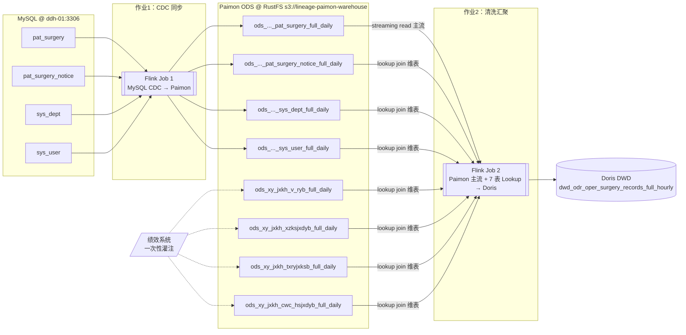
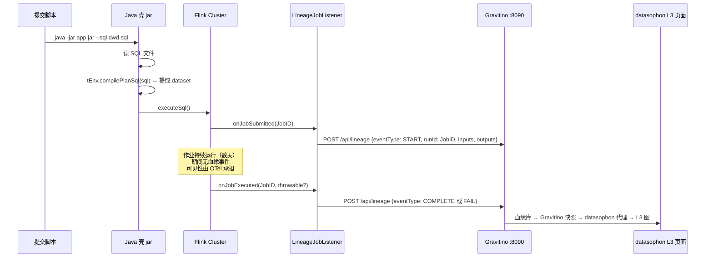

# Flink 实时链路 · 技术方案（2026-08-05，2026-08-06 按实测结果更新）

> 本文描述**技术设计本身**：架构、数据流、表设计、SQL 改写、血缘发射、指标采集。
> 执行顺序、任务分解、进度跟踪见配套的
> [实施方案](./data-lineage-Flink实时链路验证-实施方案-2026-08-05.md)。
>
> 决策依据（D1-D12、修订版 D3'）与已核实环境事实（E1-E26）在实施方案 §2/§3，本文不重复，只引用编号。
>
> **2026-08-06 更新说明**：Phase 0（现场核实）、Phase 1（基础设施）、Phase 2（数据与作业，含 T9 端到端跑通）
> 已全部完成并实测验证——MySQL CDC → Paimon ODS → 7 表 Lookup Join → Doris DWD 全链路打通，
> 19 条 golden 数据与实际输出 798 处字段（42 列×19 行）精确匹配。本文原先标注 `[待 P0 核实]`/`[待核实]`
> 的条目，凡是 Phase 0-2 范围内的均已替换为实测结论（标 **✅ 已验证**），少数设计与实测有出入的地方
> 标注了实际做法与原因。**Phase 3（血缘发射 T10-T13）/ Phase 4（前端可视化 + 最终验收 T14-T17）尚未开始**，
> 相关章节的 `[待核实]` 标记原样保留。

---

## 1. 总体架构

> **✅ 已验证（2026-08-06）**：下图结构与实测一致，唯一差异是**两个作业跑在两套独立的 Flink standalone 集群上**
> （D3' 修订，见实施方案 §2.1/§3.0）——`flink-cluster-cdc`（Flink 1.20.4）承载作业1，`flink-cluster-dwd`
> （Flink 2.0.2）承载作业2，原因是 flink-cdc 3.6.0 与 Paimon 1.2.0 在任何 Flink 2.x 版本上都凑不出官方支持
> 的组合。两套集群通过同一个 RustFS S3 warehouse 路径共享 Paimon 数据，不影响下图的数据流向。



### 1.1 两个作业的分工

| 作业 | 输入 | 输出 | 模式 | 血缘边数 |
|---|---|---|---|---|
| **作业1** | MySQL 4 表（CDC） | Paimon 4 表 | 流式，一进一出无 join | 4 入 / 4 出 |
| **作业2** | Paimon 8 表（1 主流 + 7 维表） | Doris 1 表 | 流式，主流驱动 + lookup | 8 入 / 1 出 |

绩效 4 张表（P5-P8）由 T7 一次性灌注，**不产生血缘事件**，在血缘图上是**无上游的根节点**（D7）。

> **✅ 已验证**：作业1 确认是"4 张表一个 `EXECUTE STATEMENT SET`"（见 §2.1 更新）；作业2 确认是
> "1 条主流 + 7 个 `FOR SYSTEM_TIME AS OF` Lookup Join"，均已实跑成功。T7 的 4 张绩效表灌注也已完成
> （golden 反推行 + 原始样本行合并插入，行数 22/24/26/45）。

### 1.2 血缘图预期形状

**13 个表节点 + 2 个作业节点**：

- MySQL 层 4 个（根节点，有出边无入边）
- Paimon ODS 层 8 个（其中 4 个有入边，4 个绩效表是根节点）
- Doris DWD 层 1 个（叶节点）

**A4 验收的核心**：Paimon 那 4 张表**必须是同一批节点**同时作为作业1 的输出和作业2 的输入 ——
如果 identifier 拼写在两个作业里不一致，图上会出现 8 个 Paimon 节点而不是 4 个，
链路断成两截。这就是实施方案 §8 强调"必须浏览器实机核对"的原因。

> **数据层面已间接验证**：作业1 写 Paimon、作业2 读同一批 Paimon 表，物理层面确认是同一批表
> （T9 读到的是 T6 写的真实数据，798 处字段精确匹配，不可能读错表）。但 A4 验证的是**血缘图节点**
> 层面的 identifier 一致性（Gravitino 侧），这需要 T10/T11（血缘发射）先做完、T15（L3 图浏览器核对）
> 才能验证，**目前仍是 `[待核实]`**，不能拿数据层面的正确性替代图层面的验证。

---

## 2. 数据流设计

### 2.1 作业1：MySQL CDC → Paimon ODS

**形态**：4 张表各一条独立的 `INSERT INTO ... SELECT *`，同一个 Flink Job 内。

**为什么放同一个 Job**：血缘上表现为"一个作业 4 入 4 出"，正好构成多输出场景 ——
这是 `session-handoff-任务级流速可视化` §5.1 里 V1/V2 强调的验收支点
（**`outputStatistics` 必须按 dst dataset 匹配，不能取 `outputs[0]`**）。
拆成 4 个 Job 会让这个契约测不到。

**CDC 配置要点**：

| 项 | 取值 | 说明 |
|---|---|---|
| `scan.startup.mode` | 未显式设置，用 flink-cdc 3.6.0 默认值 | ✅ 已验证：默认行为已是先全量快照再增量，golden 数据（连同原始样本数据）在初次快照阶段就被完整消费，无需显式指定 |
| `server-id` | **未显式设置** | ✅ 已验证：P0-2 核实 ddh-01 MySQL `binlog_format=ROW`/`log_bin=ON` 均已就绪；实测未指定 `server-id` 时 flink-cdc 用内部默认区间正常工作，未与平台其他组件（DS 等）冲突。若后续接入更多 CDC 作业到同一 MySQL 实例，建议显式设置避免潜在冲突，但本次验证规模下非必需 |
| 主键 | 各表 `ID` | ✅ 已验证：Paimon 主键表 upsert 语义确认生效（T6 活体验证：插入/删除均正确同步） |

**实际 CDC 连接账号**：直接复用 Gravitino 的 `gravitino` MySQL 账号（已有 `SELECT`+`REPLICATION SLAVE`+`REPLICATION CLIENT` 全局权限），未按原计划新建专用账号——尝试新建后发现 `gravitino` 账号本身没有 `GRANT OPTION`，无法把权限授出去，索性直接复用（见实施方案 T1 行）。

### 2.2 作业2：Paimon ODS → Doris DWD

**主流**：`ods_..._pat_surgery_full_daily` 的 Paimon **streaming read**。

> ✅ **已验证**：**不需要任何显式 `scan.mode` 参数**——Paimon 主键表在 Flink 流式执行模式下默认就是
> 持续读（快照 + changelog），直接 `SELECT * FROM <table>` 即可，原设计设想的 `'scan.mode' = 'latest-full'`
> 之类的配置是不必要的复杂化。

**维表**：其余 7 张 Paimon 表走 **Lookup Join**，语法从普通 `LEFT JOIN` 改为：

```sql
LEFT JOIN <dim_table> FOR SYSTEM_TIME AS OF ps.proc_time AS <alias>
  ON <condition>
```

主流表需要声明处理时间属性：`proc_time AS PROCTIME()`。

> ✅ **已验证，但实现方式与原设计有一处偏差**：`PROCTIME()` 计算列不能通过 `CREATE VIEW`（持久化进
> Paimon catalog）声明——Paimon catalog 不支持存储含非确定性函数的视图定义，会抛
> `UnsupportedOperationException`。必须用 `CREATE TEMPORARY VIEW`（会话级，不持久化），语法本身完全确认可行。
> 同理，Doris sink 表在 `USE CATALOG paimon_s3` 上下文里也必须声明为 `CREATE TEMPORARY TABLE`
> （Paimon catalog 拒绝创建非 Paimon 连接器的持久化对象）。

**级联 lookup 的注意点**：原 SQL 里有两处级联 —— `su → cc`（`su.sync_id = cc.ygbh`）
再 `cc → dd`（`cc.xzksbh = dd.xzksbh`）。第二级 lookup 的 join 键来自第一级的查询结果，
**当第一级未命中时第二级的键为 NULL**。

> ✅ **已验证**：golden 数据集里专门构造了这个场景（第 18 行 `surgery_doctor_id` 为空，`su` 查不到，
> 级联到 `cc`/`dd`/`ee` 全部合理地查不到）以及 dd 兜底分支（第 3 行故意不建 `ee` 命中记录，验证
> `COALESCE(ee.jxksmc, dd.jxksmc)` 落到 `dd`）。T9 实跑后与 golden 逐字段比对（798 处，含这两个场景）
> **全部精确匹配**，确认 Flink lookup join 对 NULL 键**直接返回 NULL，不发起下游查询**，与 MySQL
> LEFT JOIN 语义完全一致，原设计预期成立。

**Sink**：flink-doris-connector。

> ✅ **已验证，比原设计更简单**：WITH 选项只用了 `connector`/`fenodes`/`table.identifier`/`username`/
> `password`/`sink.label-prefix` 六项，**未显式设置 `sink.properties.format=json`**，默认配置已能正确
> upsert 到 `UNIQUE KEY(surgery_id)` 表（Doris 端 33 行，与 Paimon 主流表行数一致，无丢行无重复）。

---

## 3. 表设计

### 3.1 三层口径

| 层 | 载体 | 类型口径 | 主键 | 说明 |
|---|---|---|---|---|
| 原始 | MySQL | **全 VARCHAR**（D10），**6 个无界大文本列例外用 TEXT**（见 §3.2） | 各表 `ID` | 4 张业务表，1:1 全列 |
| ODS | Paimon | **全 STRING** | 各表 `ID` | 8 张表；4 张镜像 + 4 张绩效表 |
| DWD | Doris | **全 VARCHAR**（原文档已是） | `surgery_id` | 1 张，`UNIQUE KEY` + `BUCKETS 3` |

> ✅ **已验证**：三层口径确认按此实现，中间无显式类型转换（SQL 改写里唯一涉及类型的是数字字面量改
> 字符串字面量，见 §4.1）。

**全 VARCHAR 的连带影响**（D10 代价，必须在 SQL 改写里处理）：

- 所有与数字字面量的比较都要加引号：`= 1` → `= '1'`
- `IFNULL(ps.AGE, 0)` 的 `0` 是死代码（`AGE` 实际值形如 `'74岁'`）→ 改 `IFNULL(ps.AGE, '')`
- 三层类型一致，中间**不需要任何显式类型转换**

### 3.2 MySQL 表清单

| 表 | 列数 | 主键 | 来源 |
|---|---|---|---|
| `pat_surgery` | **111**（实测，非原估的 113） | `ID` | xlsx sheet `pat_surgery（病人表）` |
| `pat_surgery_notice` | 32 | `ID` | xlsx sheet `pat_surgery_notice（病人手术通知表）` |
| `sys_dept` | 12 | `ID` | xlsx sheet `sys_dept（科室表）` |
| `sys_user` | 34 | `ID` | xlsx sheet `sys_user（人员表）` |

列名与顺序**严格照 xlsx 表头**。

> ✅ **已验证，但列宽分档与原设计不同**：原设计"名称类 `VARCHAR(255)`、`SURGERY_NAME` 用
> `VARCHAR(500)`、JSON 列用 `TEXT`"这个方案在 111 列的 `pat_surgery` 上**首次尝试就撞了 InnoDB
> 65535 字节行上限**（`utf8mb4` 每字符最多 4 字节，255×4 这个默认档位乘以上百列很快超限）。
> 实际按数据长度重新分档：默认 `VARCHAR(64)`（覆盖绝大多数 32 位 hex ID / 短代码 / 时间戳字符串）；
> 长文本关键字段（`CONTENT`/`HISTORY`/`PREPARATION`/`REASON`/`REQUIREMENT`/`REMARK`/`ADDRESS`/
> `DESCRIPTION` 及 `SURGERY_NAME`/`PATH_ID`）用 `VARCHAR(500)`；小 JSON 字段（`ANES_ASSISTANT`/
> `SURGERY_ASSISTANT`/`SURGERY_DOCTOR`/`EXTEND_INFO`/`EXTEND_ATTRIBUTE`）用 `VARCHAR(300)`；
> **无界大文本改用 `TEXT`（不是 `VARCHAR`）**：`OR_EXTEND_INFO`/`ANES_EXTEND_INFO`/`QC_EXTEND_INFO`
> 三个 JSON 大字段（实测最长 2051 字节）+ `sys_user.SIGNATURE`（实测最长 12818 字节，base64 图片数据）。
> `TEXT` 走 InnoDB off-page 存储不计入行内字节预算，从根上解决超限问题，比继续猜一个"安全"的
> `VARCHAR` 上限更省事。

**binlog 前提**：`log_bin=ON` + `binlog_format=ROW` + `binlog_row_image=FULL`。

> ✅ **已验证：ddh-01 MySQL 本来就已经是 CDC 就绪状态**，`log_bin=ON`/`binlog_format=ROW`/
> `binlog_row_image=FULL`/`server_id=1` 全部满足，**完全不需要改 `my.cnf` 或重启**——原设计设想的
> "改配置+重启"风险场景实际没有发生。

### 3.3 Paimon ODS 表清单

命名严格按清洗 SQL（**不是 xlsx sheet 名**，见实施方案 §3.3）：

| Paimon 表 | 上游 | 类型 |
|---|---|---|
| `ods_smxt_lancet_aims_pat_surgery_full_daily` | MySQL `pat_surgery` | 主流源 |
| `ods_smxt_lancet_aims_pat_surgery_notice_full_daily` | MySQL `pat_surgery_notice` | 维表 |
| `ods_smxt_lancet_aims_sys_dept_full_daily` | MySQL `sys_dept` | 维表 |
| `ods_smxt_lancet_aims_sys_user_full_daily` | MySQL `sys_user` | 维表 |
| `ods_xy_jxkh_v_ryb_full_daily` | 无（根节点） | 维表 |
| `ods_xy_jxkh_xzksjxdyb_full_daily` | 无（根节点） | 维表 |
| `ods_xy_jxkh_txryjxksb_full_daily` | 无（根节点） | 维表 |
| `ods_xy_jxkh_cwc_hsjxdyb_full_daily` | 无（根节点） | 维表 |

**Paimon 建表要点**：主键表（`PRIMARY KEY ... NOT ENFORCED`）；实际用 `'bucket' = '4'`（原设计建议
`'1'`或`'-1'`动态，验证规模数据量小，`4` 也没有实质影响，未特别调优）。

> ✅ **已验证，但 S3 接入路径与原设计完全不同**：**没有走 `gravitino.bypass.*` 透传**，也**没有经过
> gravitino-flink-connector**。因为 Gravitino 的 `paimon_s3` catalog 本质是 `catalog-backend=filesystem`
> ——它不是独立元数据库，只是对同一个 S3 warehouse 路径的一层 API 包装。Flink 直接用 Paimon 原生
> `'type' = 'paimon'` catalog 指向**同一个** `s3://lineage-paimon-warehouse/` 路径 + 标准
> `s3.endpoint`/`s3.access-key`/`s3.secret-key`/`s3.path.style.access` 四个 key，看到的和建出的表
> 与 Gravitino 侧完全是同一批物理文件，不需要 `gravitino.bypass.*` 透传这层复杂度（那是 Gravitino
> 自己内部建 catalog 时的坑，Flink 客户端直连不受影响）。
>
> **接入本身也踩了不少坑**（详见实施方案 E17-E20）：官方文档推荐的 `paimon-s3-1.2.0.jar` 实测在
> SQL Client 场景类加载失败；改用 `flink-s3-fs-hadoop-<版本>.jar` 放 `lib/`（非 `plugins/`）+ 额外补
> `hadoop-hdfs-client`/`hadoop-mapreduce-client-core` 两个 Hadoop 依赖才跑通。另外 **官方发布的
> `paimon-flink-2.0-1.2.0.jar` 本身有已知 bug**（[paimon#6007](https://github.com/apache/paimon/issues/6007)，
> 打包时选错 Maven profile），建表不受影响但真正写数据会 `NoClassDefFoundError`，DWD 集群改用
> `paimon-flink-2.0-1.3.1.jar` 解决。

### 3.4 Doris DWD 表

沿用业务文档给的建表语句，补沙箱参数：

```sql
PROPERTIES (
  "replication_num" = "3"   -- 沙箱 3 个 BE
)
```

> ✅ **已验证**：`SHOW BACKENDS` 实测 3 BE Alive，`replication_num=3` 确认正确；表结构与原文档 SQL
> 逐字段一致；库名新建为 `lineage_flink_verify`（独立于既有的 `lineage_probe` 验证库）。

---

## 4. SQL 改写方案

这是本次验证价值最高的部分之一：**把 Doris 方言的清洗 SQL 改写成 Flink SQL**。
下表逐条列出改写点，实施时（T8）必须产出同样结构的对照清单，**每条含原文 / 改后 / 原因三列**。

### 4.1 函数级改写

> ✅ **全部已实跑验证**（T9，798 处字段精确匹配），下表按实际最终方案更新，与原设计不同的地方标出。

| # | 原 SQL | 改写方案 | 原因 | 状态 |
|---|---|---|---|---|
| F1 | `IFNULL(x, '')` | 保持不变 | Flink SQL 内置 `IFNULL`，语义一致 | ✅ 已验证 |
| F2 | `IFNULL(ps.AGE, 0)` | `IFNULL(ps.AGE, '')` | 全 VARCHAR 下 `0` 类型不符；且 `AGE` 实际值形如 `'74岁'`，该默认值本就是死代码 | ✅ 已验证 |
| F3 | `CASE ps.TYPE WHEN 1 THEN ...` | `WHEN '1' THEN ...`（10 个分支全改） | 全 VARCHAR，字符串不能与整型字面量比较 | ✅ 已验证 |
| F4 | `CONCAT_WS('、', a, b)` | 保持不变，外层加 `IFNULL(...,'')` | Flink `CONCAT_WS` 两参数全 NULL 时返回**空字符串**（非 NULL），与 Doris 语义一致，原本担心的"待核实"点确认没有问题；外层 `IFNULL` 是保险，未观察到需要它触发的场景 | ✅ 已验证 |
| F5 | `JSON_VALID(x)` | **不是删除，而是替换为 `x IS JSON ARRAY`** | Flink 无 `JSON_VALID`，但有 ANSI SQL 2016 标准的 `IS JSON` 谓词；选 `ARRAY` 而非泛化的 `VALUE` 因为后续 `$[0]` 路径本就假定数组结构，比原设计"直接删除该条件"更贴近原逻辑意图 | ✅ 已验证（**与原设计不同**：原设计想直接删掉，实际发现有更贴切的替代） |
| F6 | `JSON_UNQUOTE(JSON_EXTRACT_string(x, '$[0].name'))` | `IFNULL(JSON_VALUE(x, '$[0].name'), '')` | `JSON_EXTRACT_string` 是 Doris 专有函数；Flink `JSON_VALUE` 自带 unquote，外层加 `IFNULL` 兜底路径取不到值时的 NULL（原设计未提及这一层，实测发现需要） | ✅ 已验证（**与原设计略有出入**：多包了一层 `IFNULL`） |
| F7 | `LOCATE('Ⅳ级', x) > 0` | `POSITION('Ⅳ级' IN IFNULL(x, '')) > 0` | **Flink 确认也有 `LOCATE`**（`LOCATE(string1, string2[, integer])`，语义与原 SQL 一致，原设计的"待核实"已解），但最终选用标准 `POSITION` + 显式 `IFNULL` 处理 NULL，而不依赖未在文档里明确验证过的 `LOCATE(x, NULL)` 隐式行为 | ✅ 已验证 |
| F8 | `now() as etl_time` | `CAST(NOW() AS STRING)` | 目标列是 `VARCHAR`；**未用原设计的 `DATE_FORMAT(CURRENT_TIMESTAMP, ...)`**，`CAST(NOW() AS STRING)` 更简单且实测格式满足需要，流模式下的求值时机未观察到异常（每条数据得到的 `etl_time` 均为作业处理该行时的实际时间） | ✅ 已验证（**与原设计不同**：更简单的写法） |
| F9 | `COALESCE(ee.jxksmc, dd.jxksmc)` | 保持不变 | Flink 有 `COALESCE`，级联 lookup NULL 键场景已验证正确落到 `dd` 分支 | ✅ 已验证 |
| F10 | `null AS yblx`（4 处） | `CAST(NULL AS STRING) AS yblx` | Flink SQL 要求 NULL 字面量有明确类型 | ✅ 已验证 |

### 4.2 结构级改写

> ✅ **全部已实跑验证**。

| # | 原 SQL | 改写方案 | 原因 | 状态 |
|---|---|---|---|---|
| S1 | `WHERE ps.VALID = 1 AND ps.IS_TRANSFER_ROOM = 0` | `= '1'` / `= '0'` | 全 VARCHAR | ✅ 已验证 |
| S2 | 7 个 `LEFT JOIN <table> ON ...` | `LEFT JOIN <table> FOR SYSTEM_TIME AS OF ps.proc_time AS ... ON ...` | Flink Lookup Join 语法 | ✅ 已验证 |
| S3 | 主表 `FROM ods_..._pat_surgery ps` | 需在主流表声明 `proc_time AS PROCTIME()`，用 `CREATE TEMPORARY VIEW` 包一层（**非 `CREATE VIEW`**，见 §2.2） | Lookup Join 的前提；`CREATE VIEW` 持久化进 Paimon catalog 不支持非确定性函数 | ✅ 已验证（**与原设计有出入**：必须 TEMPORARY） |
| S4 | `LEFT JOIN ... psn ON psn.PATIENT_ID = ps.PATIENT_ID` | **保持不变**（D9 忠实复现） | 关联键非唯一会放大行数，这是原 SQL 的既有缺陷，本次不修 | ✅ 已验证（golden 集按 D9 造成一对一，另一对多放大用例未在本轮做，留给后续） |
| S5 | Doris sink 表声明 | `CREATE TEMPORARY TABLE`（**非 `CREATE TABLE`**） | 同 S3：Paimon catalog 不接受非 Paimon 连接器的持久化对象（原设计未预见这一点，是 T9 实跑才发现） | ✅ 已验证 |

### 4.3 已知语义偏差（改写后必须记录的）

| 偏差 | 影响 | 缓解 | 状态 |
|---|---|---|---|
| Lookup Join **不回溯**：维表变更不刷新历史宽表 | 医生换科室后，历史手术记录的科室名不变 | D1 已接受，写进验证报告 | 设计层面成立，未做变更后回溯的专项测试 |
| `notice` 一对多导致 `sqkk`/`jxks_sync_id`/`jxks` 三列取值不确定 | golden 比对可能抖动 | golden 集造成一对一（T5） | ✅ 已验证：19 行全部精确匹配，一对多放大用例本轮未造，留给后续 |
| ~~`CURRENT_TIMESTAMP` 在流模式的求值时机~~ | 不适用 | 改用 `NOW()`（见 F8），实测每行 `etl_time` 均为处理该行时的实际时间，未发现异常求值行为 | ✅ 已解决（改了实现方式，原疑虑不再适用） |

---

## 5. 血缘上报设计

> ⚠️ **本章对应 T10-T11，尚未实施**，以下 `[待核实]` 标记原样保留。但 Phase 0 核实过程中发现两处
> 会影响本章设计假设的事实，已更新：`CanonicalNameResolver` 实际类名与鉴权方式。

### 5.1 发射机制



**为什么不用 `openlineage-flink`**：E5 已验证 —— Flink 的 FLIP-314 dataset 血缘依赖
connector 实现 `LineageVertexProvider`，至今**只有 Kafka**，Paimon / Doris / MySQL-CDC
全部产出**空 dataset**；且集成主要面向 DataStream API，SQL/Table API 覆盖更差。
自研发射器还有一个额外好处：**identifier 拼写由我们控制**，可以直接迁就接收端解析逻辑的期望格式。

> ✅ **P0-3 已核实，两处更新**：
> 1. **命名过期**：接收端实际类名是 `LineageDatasetParser`（`gravitino/lineage/src/main/java/org/apache/gravitino/lineage/storage/LineageDatasetParser.java`），不是 `CanonicalNameResolver`——这是架构文档的历史命名，代码已经重构过。
> 2. **原描述的"已知缺陷"（E7）经源码实读证伪**：`LineageDatasetParser.parse()` 全程没有任何 `UNRESOLVED_DATASET` 拒绝分支，能正确处理"`namespace` 含完整 `catalog/database` 路径"和"`namespace=scheme://host` + `name=db.table`"两种常见命名习惯，**T10 发射端按本文 §4.3 契约命名即可，不需要改 gravitino fork**。
>
> **鉴权方式已变化**（E14，2026-08-03 起）：Gravitino REST API 收紧为纯 `oauth`，`/api/lineage` 一律要求
> HS256 签名的 Bearer JWT，**不能像下面时序图暗示的那样直接 POST**。已有先例：Spark 侧走
> `gravitinoLineageToken` 静态 JWT（部署手册 L938-980，用 `gravitino.authenticator.oauth.defaultSignKey`
> 铸造），**T10 的 Flink JobListener 必须复用同一套铸造机制**，不能自行发明鉴权方式。

### 5.2 dataset 提取（D5）

**主路**：`tEnv.compilePlanSql(sql).asJsonString()` → 解析 JSON plan，
从 source / sink 节点提取表标识。这是**执行计划真相**，不会与实际跑的 SQL 漂移。

**兜底**：`CompiledPlan` 提取不到的（预期是 lookup join 的维表 [待 P0 核实]），
从 SQL 同目录的 `lineage-fallback.yaml` 读取。

**强制约束**：兜底补进来的 dataset **必须在日志里逐条标出**，格式如：

```
[lineage] dataset resolved from CompiledPlan: paimon://.../ods_..._pat_surgery_full_daily
[lineage] dataset resolved from FALLBACK CONFIG: paimon://.../ods_..._sys_dept_full_daily
```

不许"自动提取"和"人工补录"混在一起还看不出来 —— 否则半年后没人知道这张图有多少是真的。

### 5.3 事件格式

遵循 OpenLineage 规范，最小必要字段：

```jsonc
{
  "eventType": "START",              // START / COMPLETE / FAIL
  "eventTime": "2026-08-05T10:00:00.000Z",
  "run":  { "runId": "<Flink JobID>" },
  "job":  { "namespace": "flink://ddh-02:8081", "name": "<作业名>" },
  "inputs":  [ { "namespace": "...", "name": "..." } ],
  "outputs": [ { "namespace": "...", "name": "..." } ],
  "producer": "https://github.com/88fantasy/datasophon/flink-lineage"
}
```

`namespace` / `name` 的确切拼写以 P0-3 的实测结论为准（§4.3 契约）。

---

## 6. 指标采集设计

> ⚠️ **本章对应 T12-T13，尚未实施**，但 Phase 0 已核实两个关键前提（P0-5/P0-6），更新如下。

### 6.1 通路

```
Flink TaskManager/JobManager
  │  flink-metrics-otel (FLIP-385)  ✅ 已验证：自 Flink 2.0.0 起随官方发行版原生提供，非第三方插件
  ↓  OTLP gRPC
otelcol @ ddh-02:4317
  │  metrics pipeline（须确认白名单放行 Flink 标签）
  ↓
Doris otel_metrics_* 表
  │  counter 字段级 rate builder（复用 JuiceFS 模式）
  ↓
datasophon-api 速率端点（复用任务级流速方案 §3.2 契约）
  ↓
ui-v2 前端展示
```

**为什么用 OTLP 推送而不是 Prometheus scrape**：与 PhaseG P1 已定方向一致 ——
Flink JM/TM 是按作业生命周期存在的进程，端口会漂移，静态 scrape target 不适用；
且 OTLP 直推与 scrape 互斥，同时开会重复计数。

### 6.2 指标选取与边级映射（D6）

| 指标 | 来源算子 | 映射到血缘图的 |
|---|---|---|
| `numRecordsOut{operator_name=~"Source.*"}` | CDC / Paimon source | **入边**的行数 |
| `numRecordsOut{operator_name=~".*(Writer\|Committer).*"}` | Paimon / Doris sink | **出边**的行数。⚠️ **2026-08-07 T16 实机验证修订**：原设计的 `Sink.*` 正则是未经验证的猜测，实测两个 connector 的真实算子命名都不含"Sink"字样——Paimon 走两阶段提交，拆成 `...: Writer`（**恒为 0，纯 pass-through，不计数**）和真正累积写入数的 `...Committer` 两个独立算子；Doris connector 把 sink 融合成单一的 `<table>_sink[n]: Committer`，没有独立 Writer 阶段。改用 `.*(Writer\|Committer).*` 后两个 connector 都能命中，且不会双重计数（Paimon 的 Writer 分支贡献恒为 0） |
| `numBytesOut` | 算子间网络 | ⚠️ **sink 写外部系统的字节不计入，很可能是 0** |
| `numBytesSend` / `numRecordsSend`（FLIP-33） | sink 专用 | ✅ **已验证：Paimon、Doris connector 均未按字面实现这两个标准指标名**，但都有等价数据——Doris `DorisWriter`/`DorisWriteMetrics` 用 `SinkWriterMetricGroup` 注册自定义计数器 `totalFlushLoadedRows`/`totalFlushLoadBytes`；Paimon `CommitterMetrics`（committer 阶段）用 `IO_NUM_RECORDS_OUT`/`IO_NUM_BYTES_OUT`（复用算子级 IO 指标命名）。**T16 实测未采用这条路径**：改用上一行的通用 operator 级 `numRecordsOut` + `operator_name` 正则筛选，理由是能与入边（source）指标走同一套查询模型和同一套白名单（`job_id`/`operator_name`），不需要为每个 connector 单独适配指标名；这两个 connector 专属指标目前仍未被订阅，**T13 自研埋点依旧判定用不上** |

**Flink 相对 Spark 的优势**：Spark 的 `ExecutorSource` 只有 executor 级聚合，
给不出"这条边的流速"（流速调研文档 §4 的核心风险点）。
Flink 的 metric 天然带 `operator_name`，而 SQL 作业的 source / sink 是独立算子，
**所以边级流速在 Flink 上是可达的**。

**映射的脆弱点**：Flink SQL 自动生成的算子名又长又含特殊字符。
缓解手段：开 `table.exec.simplify-operator-name-enabled`；
若实机发现映射仍不可靠，对 Doris DWD sink 这条最关键的边改用 T13 的自研埋点（D6 已预留）。

### 6.3 速率计算的已知陷阱

`numRecordsOut` 是**累计 counter**，速率靠 `(本次值 - 上次值) / 时间差` 得出。
**作业重启会让 counter 归零**，差分出巨大负值或尖峰。
阶梯造数（D12）里"停 3min 再恢复"那段正好触发这个场景 ——
实施时必须观察并在报告里记录实际表现（A6）。

---

## 7. 前端设计（D11）

**复用**任务级流速可视化方案 §3 的契约，扩展到 Flink，不另起一套。

| 复用点 | 说明 |
|---|---|
| 速率端点契约（§3.2） | 请求/响应结构不变，`engine` 维度增加 `flink` |
| OTel 指标命名（§3.3） | Flink 指标按同一命名规则落库 |
| 前端渲染（`flowingLineageEdge.ts` 等） | 边上的流动虚线、行数/流量标签直接复用 |

**若实机发现该契约对 Flink 不适用**（例如 Spark 的 `key_instance` 维度在 Flink 下语义不同），
**带具体证据回来找用户确认，不得擅自另起一套** —— 否则半年后会有两套速率模型。

---

## 8. 待核实项汇总

本文所有 `[待核实]` 标记的集中清单，与实施方案 Phase 0 对应。**2026-08-06 更新**：1-3、6-10 共 8 项
已在 Phase 0-2 实测验证完毕；4 项因命名过期已更正结论；剩余仅 5 一项对应 T11，Phase 3 未开始。

| # | 待核实 | 对应 P0/T | 结论 |
|---|---|---|---|
| 1 | Flink 2.x × Paimon 1.2.0 × doris-connector × flink-cdc 四方兼容交集 | P0-1 | ✅ **已核实，确认无官方 2.x 组合**：flink-cdc 3.6.0 仅发布 1.20/2.2 构建，Paimon 1.2.0 仅支持到 2.0。**用户裁决 D3'**：T6（CDC→Paimon）用 Flink 1.20.4 独立集群，T9（Paimon→Doris）用 Flink 2.0.2 独立集群，两套 standalone 分开部署，未回退到单一 1.20 集群 |
| 2 | Paimon 1.2.0 streaming read 的确切参数名 | P0-1 | ✅ **已验证：不需要任何参数**，Paimon 主键表默认即为流式读，直接 `SELECT *` 即可（见 §2.2） |
| 3 | MySQL binlog 状态与可用 `server-id` 区间 | P0-2 | ✅ **已验证：binlog 本来就绪，无需改配置重启**；`server-id` 未显式设置也未冲突（见 §2.1） |
| 4 | `CanonicalNameResolver` 实际接受的格式 | P0-3 | ✅ **已核实，命名已过期**：实际类是 `LineageDatasetParser`，源码实读确认原设想的"已知缺陷"（E7）不存在，无需改 gravitino fork（见 §5.1） |
| 5 | `CompiledPlan` 能否提取 lookup join 维表名 | P0-1/T11 | **仍未验证**——T11（Phase 3）未开始 |
| 6 | Flink `flink-metrics-otel` (FLIP-385) 可用性 | P0-5 | ✅ **已验证：自 Flink 2.0.0 起原生提供**，无需改用 Prometheus scrape（见 §6.1） |
| 7 | Paimon/Doris sink 是否实现 FLIP-33 sink metrics | P0-6 | ✅ **已验证：均未按字面实现，但有等价数据**（各自的自定义指标名），T13 大概率不需要自研埋点（见 §6.2） |
| 8 | Flink 是否有 `LOCATE` / `IFNULL` / `CONCAT_WS` 及其 NULL 语义 | T8 | ✅ **已验证：三者 Flink 均有，语义与 Doris/MySQL 一致**；最终改写选用 `POSITION`（非 `LOCATE`）是工程选择而非必须（见 §4.1 F4/F7） |
| 9 | Lookup Join 对 NULL join 键的行为（级联 lookup 场景） | T9 | ✅ **已验证：直接返回 NULL，不发起下游查询，与 MySQL LEFT JOIN 语义一致**——golden 数据专门构造了级联未命中场景，798 处字段比对全部匹配（见 §2.2） |
| 10 | 流模式下 `CURRENT_TIMESTAMP` 的求值时机 | T8 | ✅ **已解决（问题不再适用）**：改用 `CAST(NOW() AS STRING)`（非 `CURRENT_TIMESTAMP`/`DATE_FORMAT`），未观察到异常求值（见 §4.1 F8） |

**另有 3 项本文原未预见、Phase 0-2 实测中新发现的问题，均已解决**（详见实施方案 E17/E19/E21-E26）：
`paimon-flink-2.0-1.2.0.jar` 官方发布物本身有 bug（需换 1.3.1）、两套 Flink 集群共享默认 PID 路径导致
互杀进程、RustFS/Doris 两处密码此前记录有误（用户直接纠正后确认真实值并完成密码轮换）。

---

## 9. 参考

- [实施方案（任务清单与进度）](./data-lineage-Flink实时链路验证-实施方案-2026-08-05.md)
- [平台级血缘架构](./data-lineage-平台级血缘架构-2026-07-29.md) — §1.1 能力矩阵、§3.3 身份规范
- [任务级流速可视化实施方案](./data-lineage-任务级流速可视化-实施方案-2026-08-04.md) — §3 契约来源
- [流速采集调研](./data-lineage-流速采集调研-2026-08-04.md) — §4 粒度不匹配风险
- [PhaseG Flink 血缘与监控](./observability-otel-phaseG-flink-血缘与监控-实施计划-2026-07-27.md) — 监控部分仍有效
- [五节点部署手册](../deploy/deployment-standalone-doris.md) — §7.13/§7.14 环境事实
- [业务需求原文](./lineage/dwd层建表语句清洗语句.md)
