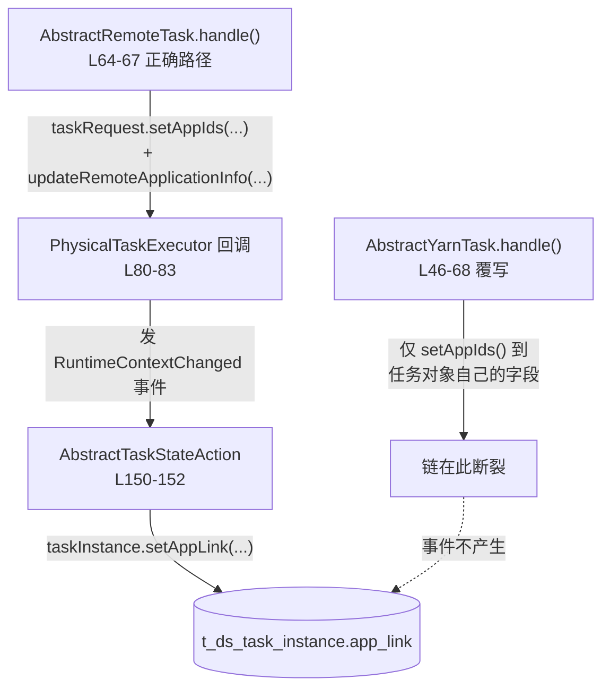
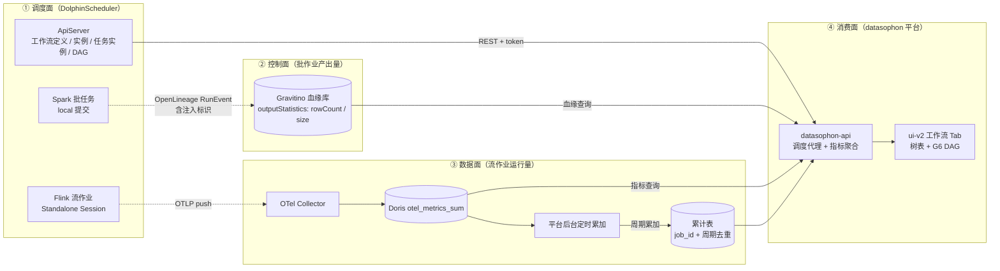
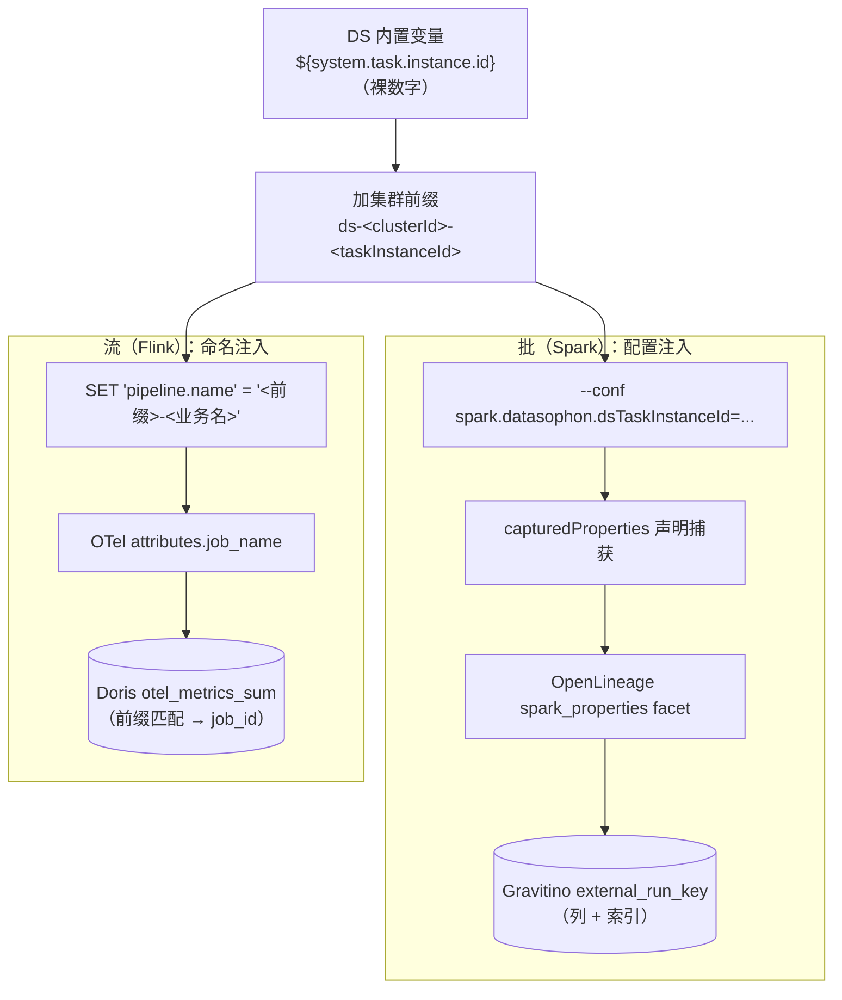
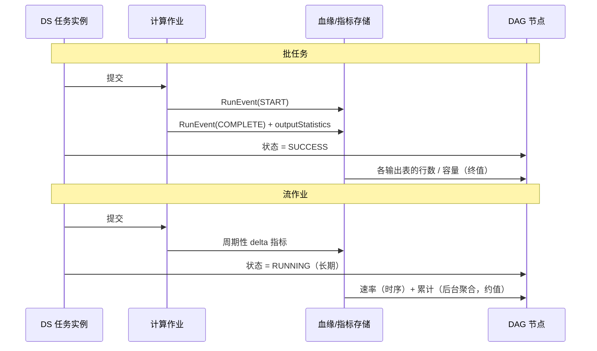

# 调度作业可视化与任务级流量归属 · 架构设计

> **文档性质**：面向架构师与技术人员的架构文档，描述 DolphinScheduler 工作流可视化的目标架构，以及支撑它的绑定模型。
> **不包含**：任务分解、进度跟踪、排障记录和环境变更登记。相关内容见配套执行任务清单，本文只引用结论。
> **读者范围**：内部评审。文中保留沙箱主机角色、端口与版本矩阵，但不含任何凭据、密钥与运维事故记录。
> **业务口径已脱敏**：验证链路来自真实业务需求。本文使用中性表名（`ods_biz_order` / `dwd_biz_wide` / `dws_biz_agg` 等），只保留表数量、分层拓扑与量级等评审所需信息。
> **能力定位**：本期是**只读展示**形态，不承诺对调度的任何写入能力（§3.3）。
>
> **修订记录**
>
> | 日期 | 变更 |
> |---|---|
> | 2026-08-24 | 评审稿。绑定模型与三面分工成形，其中批/流两条链尚未端到端验证，`app_link` 与 `outputStatistics` 的结论来自源码与仓库检索 |
> | **2026-08-25** | **转为已验证稿**。批/流两条绑定链**均在沙箱端到端跑通并逐值核对**（§9.1）；原遗留缺口 **G1–G5 全部关闭**（Gravitino 改造已实现并验收、接口契约已定稿、两项待决已裁决）；新增 §2.5 **平台前置缺陷**（两条阻断性缺陷，落地前必须先修）；绑定标识格式修订为带集群前缀（§4.3）；静默错误从 4 类扩充至 **7 类**（§2.4） |

---

# 目录

- [前言](#前言)
- [第一章 定位与使命](#第一章-定位与使命)
- [第二章 现状与问题](#第二章-现状与问题)
- [第三章 目标与非目标](#第三章-目标与非目标)
- [第四章 总体架构](#第四章-总体架构)
- [第五章 核心组件](#第五章-核心组件)
- [第六章 跨层接口与契约](#第六章-跨层接口与契约)
- [第七章 安全与权限](#第七章-安全与权限)
- [第八章 验收要点](#第八章-验收要点)
- [第九章 落地路线与风险](#第九章-落地路线与风险)
- [附录 A 本域专有术语](#附录-a-本域专有术语)
- [附录 B 参考文档](#附录-b-参考文档)

---

# 前言

平台已经能看到「一张表从哪里来」（血缘图），也能看到「一个 Flink 作业此刻每秒多少行」（流速），但看不到**调度视角**：一个工作流由哪些任务组成、这次跑到第几步、每一步实际写出了多少数据。运维要回答「昨晚那批数据为什么少了」，目前只能在 DolphinScheduler 的 Web UI 看状态、再切到血缘图找作业、再切到监控看板找指标，三处的对象还对不上号。

难点不在展示，在**归属**。DAG 上的节点是**调度任务**，而行数和速率属于**计算作业**。调度系统和计算引擎是两套独立的身份体系：DS 认的是 `taskInstanceId`，Spark 认的是 `spark.app.id`，Flink 认的是 32 位 hex 的 `JobID`。把它们对上号，本应由 DS 的 `app_link` 字段承担——**但该字段在 DS 3.4.1 上对 Flink/Spark 任务恒为空**（§2.1），这是上游在 3.3/3.4 执行器重构中引入的回归，不是配置问题。

绕开它有四条路：解析任务日志、按作业名匹配、给上游打补丁、或者**让平台自己把调度标识注入到计算作业里**。本方案选择最后一条，因为它是唯一在错误时**静默失败而非静默错配**的方案：注入的标识要么完整传回、要么完全没有，不会像名字匹配那样把 A 作业的行数显示到 B 任务上。

另一个约束来自引擎能力。行数与容量依赖 OpenLineage 的 `outputStatistics` facet，而**该 facet 只有 Spark 集成实现，Flink 集成没有**（§2.2）。因此本方案对批与流采取不同的取数路径：批任务的量走血缘，流作业的量走指标。这不是权宜，是两类作业本身的差异——批有终值，流只有速率。

本文讨论四个问题：调度对象与计算对象如何建立可信绑定，批与流的量分别从哪里来，节点上的信息如何组织，以及当前实现距离生产还有哪些缺口。

---

# 第一章 定位与使命

本方案定义 datasophon 平台中**调度作业可视化**的架构规范，范围覆盖调度元数据获取、任务级流量归属、以及工作流 DAG 的呈现。

上游是三个既有子系统，本方案不重建其中任何一个：

- **DolphinScheduler**（受管服务 `DS`，3.4.1）：工作流定义、实例、任务实例与 DAG 拓扑的唯一事实源。
- **Gravitino 血缘库**：作业与数据集的结构、运行记录，以及**批作业的输出统计**（行数、字节、文件数）。
- **Doris OTel 指标库**：**流作业的运行期流量**。

下游使用方是组件详情页的「工作流」Tab，以及后续可能的作业健康度视图。

跨层交接分为三个面，在**前端**才汇合：

- **调度面**的交接点是 DS Open API，承载**结构与状态**：有哪些工作流、这次跑到哪一步、每个任务是成功还是失败。
- **控制面**的交接点是 OpenLineage `RunEvent`，承载**批作业的产出量**：这次运行写了哪几张表、各多少行多少字节。
- **数据面**的交接点是 OTel 指标，承载**流作业的运行期流量**：此刻每秒多少行、自启动以来累计多少。

三个面各自独立失败。任何一面不可用时，其余部分仍应可见（§4.6 降级）。

---

# 第二章 现状与问题

## 2.1 归属断层：`app_link` 恒空

DS 3.4.1 的 `t_ds_task_instance.app_link` 是设计上承载 YARN application id 的字段，接口也会返回它，但**对 Flink/Spark 这一族任务永远是空**。调用链如下（已双人复核上游 tag `3.4.1` 源码）：



`FlinkTask` 与 `FlinkStreamTask` 均继承自 `AbstractYarnTask`，**批流走同一个断裂实现**。`FlinkStreamTask` 中确有两处写回上下文的语句，但只在 `cancelApplication()` 与 `savePoint()` 路径上，正常运行不经过。对照 3.2.2，`WorkerTaskExecutor` 当年有 `taskExecutionContext.setAppIds(task.getAppIds())` 这一句，**是重构时丢的**。

即便修复写入，仍有第二层障碍：DS 的 appId 采集正则只认 `application_\d+_\d+`（YARN 形态），而本方案的 Flink 采用 Standalone 部署、Spark 采用 local 提交，**都不产生这种标识**。

## 2.2 能力断层：`outputStatistics` 只有 Spark 有

行数与容量依赖 OpenLineage 的 `OutputStatisticsOutputDatasetFacet`（含 `rowCount` / `size` / `fileCount`）。对照检索 OpenLineage 仓库：

| 集成 | `OutputStatisticsOutputDatasetFacet` 命中 |
|---|---:|
| `integration/spark` | **10 处** |
| `integration/flink` | **0 处** |

Flink 2.x 的 FLIP-314 原生血缘提供的是**拓扑**（哪个 source 到哪个 sink），不提供统计量。因此「批任务显示总行数」这一需求，**在 Flink 批作业上开箱不成立**，在 Spark 上成立且实测精确。

## 2.3 语义断层：流作业没有「总数」

Flink 的 OTLP reporter 导出 **Delta Sum**——实测 `otel_metrics_sum` 的 `aggregation_temporality = Delta`、`is_monotonic = 1`，**没有可读的累计值**。累计只能对窗口内 delta 求和，而实测点密度为 **6.5k–7.2k 采样点 / 作业 / 小时**，一个连续运行 10 天的流作业约 150 万–170 万个点。按前端刷新频率实时聚合不可行。

## 2.4 四类静默错误

以下四类错误的共同特征是**不报错、只给出错误的数字或空白**，因此必须在架构层面而不是测试层面消除：

| # | 错误 | 触发条件 | 后果 |
|---|---|---|---|
| E1 | **张冠李戴** | 按作业名匹配调度任务与计算作业 | A 任务显示 B 作业的行数；两侧命名格式实测完全不一致（§6.1） |
| E2 | **查错指标表** | Flink 三条 reporter 路径混淆 | 静默返回零行，表象与「没有数据」无法区分 |
| E3 | **节点凭空消失** | `GET /task-instances` 的 `taskExecuteType` 默认 `BATCH` | 流作业任务节点在 DAG 上不出现 |
| E4 | **幽灵节点** | 未丢弃实例 DAG 中 `preTaskCode == 0` 的哑元边 | 图上多出一个不存在的起点 |
| E5 | **速率恒为 0 被误读为「作业没跑」** | 流作业的 source 与 sink 被算子链合并（无 shuffle），跨算子记录数不计入 `numRecordsOut` | 节点显示 `0 row/s`，而作业其实在正常处理数据。**「0」与「未绑定」必须是两种可区分的展示** |
| E6 | **按状态码判活全绿逃逸** | DS 3.3 起改名后的旧路径（如 `/process-definition`）返回的是 **HTTP 200 + 一整页 HTML**（被前端 SPA 路由兜住），而非 404 | 健康检查与探活全部通过，只有真正解析 JSON 时才炸 |
| E7 | **跨集群标识相撞** | 直接用 DS 的裸任务实例 id 作为绑定标识 | 血缘侧的绑定键是**全局键、无命名空间**，两套 DS 各有一个「任务实例 3」时互相覆盖（§4.3 已通过加集群前缀消除） |

## 2.5 平台前置缺陷（落地前必须先修）

以下两条**不是本方案引入的**，而是在沙箱验证过程中撞出的既有缺陷。它们**阻断本方案的一切落地**——
DS 连工作流都建不出来时，调度可视化无从谈起。详见 `docs/ds-平台缺陷-任务插件缺失与S3凭据漂移-2026-08-25.md`。

| # | 缺陷 | 症状与影响 |
|---|---|---|
| P1 | **分发的 DS 包缺全部任务插件** | 安装包中仅有 `task-api` 与 `task-executor`，SPI 只注册 5 个 logic task。**Shell / Spark / Flink / SQL 等任务在「创建工作流定义」阶段即被拒**，而接口返回的是 `request parameter {0} is not valid`——真因（`Cannot find TaskChannel for : SHELL`）只在服务端日志里。平台装出来的 DS 目前**不可用** |
| P2 | **DS 的对象存储凭据与实际不符** | 资源中心配置为 S3 形态但密钥不匹配。S3 客户端**只在服务启动时初始化一次**，因此错误被运行中的旧进程长期掩盖，**任一角色重启即无法启动**。修复须从服务元数据侧进行，否则平台重新下发配置会覆盖手工修复 |

> P2 是一类值得单独记住的失败模式：**「一直好好的」不等于「配置是对的」，只等于「还没重启过」。**

---

# 第三章 目标与非目标

## 3.1 方案目标

1. 在组件详情页提供**调度视角**的入口：项目 → 工作流定义 → 工作流实例 → DAG。
2. 为 DAG 上的每个任务节点建立**可信的**计算作业归属，使行数、容量、速率能落到正确的节点上。
3. 归属失败时**留空而非猜测**，且用户能看出「为什么没有」。
4. 三个数据面独立失败、独立降级。

## 3.2 一期能力目标（验证形态）

- 只读展示；批任务显示各输出表的行数与容量；流作业显示速率与累计约值。
- 绑定依赖用户遵守两条接入约定（§6.1），未遵守的任务显示为未绑定。
- 覆盖物理集群的 `DS` 服务。

## 3.3 范围、边界与非目标

| 非目标 | 理由 |
|---|---|
| 任何写操作（上线/下线、触发、停止） | 涉及 DS 权限模型与审计；DS 原生 UI 已提供，Tab 内以跳转承接 |
| K8s 侧 `dolphinscheduler-helm` 的同款 Tab | 后端按同一契约设计，本期不实现、不验证 |
| 自动推断绑定（无需用户约定） | 所有自动推断方案都以 E1 为代价，见 §4.3 |
| 列级血缘、影响分析 | 属血缘域，见配套架构文档 |
| Spark 4.x / SPARK3 受管纳管 | 需换 Scala 2.13 构建线与 OpenLineage 版本、处理 HIVE 依赖，够独立立项 |

---

# 第四章 总体架构

## 4.1 系统边界与总体数据流



*系统边界与总体数据流*

**① 调度面**：DS 是工作流结构与任务状态的唯一事实源，平台不镜像、不缓存其状态。计算作业由 DS 调度拉起，作业自身携带平台注入的调度标识。

**② 控制面**：Spark 批作业通过官方 `openlineage-spark` listener 上报事件，事件中同时携带产出统计与注入的调度标识。Gravitino 是该数据的唯一权威。

**③ 数据面**：Flink 流作业通过 OTLP 推送指标，落 Doris。由于 delta 语义（§2.3），累计量由平台后台定时任务周期累加落表，前端读表。

**④ 消费面**：平台按需向三个面取数并在前端合并。**三个面不在后端做强耦合的联表**——任一面不可用时其余仍可展示。

## 4.2 三条通路的分工

| 维度 | 通路 | 权威方 | 语义 |
|---|---|---|---|
| 工作流定义 / 实例 / 任务状态 / DAG 拓扑 | DS Open API | DolphinScheduler | 结构与生命周期 |
| **批任务**的行数 / 容量 | OpenLineage → Gravitino | Gravitino 血缘库 | **终值**，随运行不可变 |
| **流作业**的速率 / 累计 | OTLP → Doris → 平台累加表 | Doris（原始）+ 平台（累计） | **时序**，随时间演进 |

选择 DS Open API 而非直连其元数据库，是为了不把平台焊死在 DS 3.4.1 的 schema 上；代价是接受 API 的能力边界（无批量查询、无 `releaseState` 过滤参数，见 §6.2）。

## 4.3 绑定模型：注入式标识

这是本方案的架构核心。调度对象与计算对象的绑定有四种可能，逐一评估：

| 方案 | 机制 | 失败模式 | 采纳 |
|---|---|---|---|
| `app_link` 直读 | 读 DS 任务实例字段 | 字段恒空（§2.1） | ✗ 不可用 |
| **注入式标识** | 平台把 `taskInstanceId` 注入计算作业配置，随事件/指标回传 | **静默缺失**（显示为未绑定） | ✓ **采纳** |
| 名字匹配 | 按作业名与任务名对齐 | **静默错配**（E1） | ✗ 后果不可接受 |
| 日志解析 | 从任务 stdout 抠 appId | 格式无契约保障，远程日志开启后行为不确定 | ✗ 不稳定 |

**关键判据不是成功率，是失败方式。** 注入式标识在链路任一环断裂时，结果都是「这个节点没有指标」，用户看到 `—` 并有引导；名字匹配在断裂时会给出**看起来正确的错误数字**，而这类看板的数字会被用来做判断。

批与流的注入载体不同：



两条路径的共同点是**标识由调度侧生成、由计算侧原样携带、由查询侧精确匹配**，中间不做任何推断。

> **标识必须带集群前缀（E7）。** DS 的内置变量给出的是**裸数字**，而血缘侧的绑定键是**全局键、
> 没有命名空间**——两套 DS 各有一个「任务实例 3」时会互相覆盖。因此标识格式定为
> `ds-<clusterId>-<taskInstanceId>`，由平台侧按同一规则拼装后查询。

> **为何流侧不复用批侧的 facet 注入**：流作业的量走指标而非血缘（§2.2），指标的标签集由 reporter 决定，不接受任意注入。而 `job_name` 是标签集中唯一由作业自身完全控制的字段。

## 4.4 运行状态模型与可见性分工

批与流的生命周期不同，节点的展示规则必须分别定义：



由此得出三条展示规则：

1. **状态一律以 DS 为准**，不以血缘或指标推断。血缘侧的「运行中」判定是 `terminal_state IS NULL AND updated_at >= now-24h`，**无心跳探活**且走内存快照，与调度状态可能不一致。
2. **批任务的量是终值**，流作业的量是时序；两者在节点上的呈现形态不同，不可混用同一控件。
3. **累计量必须标注为约值**，因为它由 delta 求和得到，会因采集中断而偏小。

## 4.5 节点信息模型：一个任务对多个作业

「一个调度任务 = 一个计算作业」这一直觉假设不成立。Spark 官方集成的 `appendDatasetName` 默认开启，**每个 action / 输出数据集各产生一条 OpenLineage job**；实测一次 SQL 脚本提交产出了多条 job 与 run。

因此节点的信息模型是**一对多**：

```
任务节点
├── 输出表 A：rowCount, size
├── 输出表 B：rowCount, size
└── 输出表 C：rowCount, size
```

**按输出表分列，不求和。** 分层作业中一个任务常同时写多张表，求和得到的是没有业务含义的数字；而「哪张表写了多少行」正是使用者要看的。节点上折叠显示前 N 项，其余在详情侧栏展开。

## 4.6 部署形态与降级

```
ddh-01   ApiServer / MySQL(血缘库 gravitino_lineage_1) / Doris FE / Nexus / RustFS
ddh-02   Gravitino(:8090) / Flink Standalone × 2（2.2.1 REST:8091 · 1.20.4 REST:8081）
ddh-03   DS WorkerServer · Doris BE · Spark 3.5.8(local)
ddh-04   DS WorkerServer · Doris BE · Spark 3.5.8(local)
ddh-05   DS WorkerServer · Doris BE · Spark 3.5.8(local)
```

Spark 以 **local 模式**运行在 DS WorkerServer 所在节点——`spark-submit` 由 DS worker 本地拉起，因此 Spark 必须与 DS worker 同机。三台的 Spark 配置**必须字节级一致**，否则任务落到不同节点会出现「有时有行数、有时没有」的间歇性现象。

**同理适用于流侧**：调度器提交 Flink 作业时使用的是**本地客户端**（`${FLINK_HOME}/bin/…`），
因此**每个可能承接该任务的 worker 节点都必须具备 Flink 客户端**。当客户端只装在部分节点上时，
必须用调度器的 **worker 分组**把流任务钉到这些节点，否则任务随机落到无客户端的节点即失败。
这是「计算客户端与调度执行位置强耦合」这一约束在两种引擎上的同一表现。

> 环境变量须写在调度器的**共享环境脚本**中：其启动脚本会用共享脚本**覆盖**各角色目录下的同名文件，
> 改错位置的配置会在下一次重启时静默消失。

降级矩阵：

| 失败面 | 表现 | 其余部分 |
|---|---|---|
| DS 不可达 / token 无效 | Tab 内容区错误提示 | — |
| Gravitino 不可达 | 批任务节点指标区 `—` | 拓扑与状态正常 |
| Doris 不可达 | 流作业节点指标区 `—` | 拓扑与状态正常 |
| 用户未遵守接入约定 | 该节点 `—` + 引导 | 同一 DAG 其余节点正常 |

---

# 第五章 核心组件

## 5.1 调度取数层

平台按集群解析 DS ApiServer 端点：角色名 `ApiServer` + 端口参数 `apiServerPort`，范式与既有的 Gravitino 端点解析一致。

**但不得沿用其「状态严格 == RUNNING」的过滤**。既有实现曾因此在角色带 `EXISTS_ALARM`（进程实际健康）时把端点判为不可用，导致全平台查询失败；而 DS 的 ApiServer 长期带告警是常态。「哪些角色状态算可用」必须是显式规则。

## 5.2 批指标通路

Spark 侧的 OpenLineage 接线**已在平台元数据中完整存在**（`SPARK3/service_ddl.json`）：jar 随框架包分发、listener 注册、transport 指向 Gravitino `/api/lineage`、api_key 鉴权、`capturedProperties` 声明。本方案对它的唯一增量是**在 `capturedProperties` 中追加注入的调度标识 key**。

Gravitino 侧的改造**已完成并验收**（原 G1/G2）。改造内容与设计要点：

- **解析做成配置项**而非再写死一个 key：新增 `storage.externalRunKeys`（逗号分隔、按序取首个非空、
  **默认空 = 完全保持原行为**），避免把「只认 `spark.app.id`」的错误换成「只认另一个固定 key」。
- **存储**：绑定键落在**运行**维度（`lineage_run.external_run_key`）而非作业维度，并**建索引**——
  它是查询主键，而作业名字段无索引的教训就在同一张库里。
- **读取路径放宽**：不再限制为作业的当前运行，因此历史工作流实例能取到属于自己那一次的量。
- **查询接口按标识聚合该次运行的全部血缘作业**（下一段说明为何不是「取一个」）。

> **一次任务对应多个运行，不是一个。** 初版接口按「一个标识 → 一次运行」建模，实测被否证：
> 一次 SQL 会话产生 **7 个 run**（1 个应用级 + 每条语句若干），**统计只落在写入语句对应的那几个 run 上，
> 而应用级 run 的事件序号最大**。于是「取最新的那个 run」恰好取到没有统计的应用级 run，
> 接口稳定返回空。修正为**按标识聚合全部 run、按输出数据集分列**后，行数与实际写入逐值一致。

## 5.3 流指标通路

Flink 2.2.1 通过 `metrics-otel` 插件以 OTLP 推送至 Collector，落 Doris `otel_metrics_sum`。指标名为点分形式 `flink.taskmanager.job.task.operator.numRecordsOut`。

> **三条 reporter 路径必须分清**（E2）：1.20 的 backport 与 2.x 原生是同一份代码，走 OTLP → **delta Sum → `otel_metrics_sum`**；而 Flink 自带的 Prometheus reporter 把 Counter 误标为 gauge → 落 **`otel_metrics_gauge`**，且它是三条中**唯一提供累计值**的路径。同时配置两个 reporter 会导致双重计数。

## 5.4 平台聚合层

**累计量后台聚合**是本方案唯一需要平台新增持久化状态的组件：

- 定时任务按周期查询上一周期的 delta，累加进平台累计表；
- 幂等键为 `job_id` + 周期时间戳，保证重启可恢复、重复执行不重复累加；
- 起点取 Flink REST 的 `start-time`（由引擎权威给出，不依赖调度侧时间戳精度）。

该组件的失败模式（重启丢累计、重复累加）与本方案其余部分完全不同，需单独设计测试。

## 5.5 可视化层

- Tab 挂载于组件详情页，与既有监控 Tab 同一注册机制。
- 树表主行为工作流定义、子行为最近若干实例，**子行懒加载**（DS 无批量查询接口，必然按定义扇出）。
- **仅工作流实例行可展开 DAG**——定义本身没有状态，节点状态必须依附一次具体运行。
- DAG 使用 AntV G6 v5，优先采用 DS 实例返回的节点坐标，缺失时回退自动布局；**必须丢弃 `preTaskCode == 0` 的哑元边**（E4）。
- 节点高度随输出表数量变化，布局需在数据变更后重算。

---

# 第六章 跨层接口与契约

## 6.1 绑定标识契约（本方案的核心契约）

**契约的一部分由用户承担。** 平台无法在不修改用户作业的前提下建立可信绑定，因此以下两条是**接入前提**，而非可选优化：

| 引擎 | 约定 | 载体 |
|---|---|---|
| Spark | `--conf spark.datasophon.dsTaskInstanceId=ds-<clusterId>-${system.task.instance.id}`<br/>并确保 `capturedProperties` 含该 key | OpenLineage `spark_properties` facet |
| Flink | `SET 'pipeline.name' = 'ds-<clusterId>-<taskInstanceId>-<业务名>'` | OTel `attributes.job_name` |

未遵守约定的任务，节点显示为未绑定（`—` + 引导），**不做任何降级推断**。

**集群前缀不可省略**（E7）：DS 内置变量给的是裸数字，而绑定键在血缘侧是全局键。
两侧使用同一套拼装规则，平台按此规则构造查询条件。

**为何名字不能作为标识**：两侧的作业命名格式实测完全不一致——Spark 官方集成将 `job.name` 强制规范化为 `<规范化appName>.<规范化节点名>[.<数据集名>]`（小写、非字母数字转下划线、camelCase 拆词），而 Flink 侧若不显式设置 `pipeline.name`，SQL 自动生成的名字形如 `insert-into_<catalog>.<库>.<表>_sink`，多 sink 时逗号拼接成数百字符。**两者都不可能等于 DS 的任务名。**

## 6.2 调度侧契约与其能力边界

| 能力 | 现状 | 架构影响 |
|---|---|---|
| 按项目列工作流定义 | 支持分页；**无 `releaseState` 过滤参数**；无分页的精简列表接口**不返回该字段** | 平台侧自造过滤只能二选一地承受「每页条数跳变」或「每次全量拉取」。**已裁决：按调度侧规则透传分页**，把上线状态原样交给前端标记与筛选（原 G4 关闭） |
| 按定义查实例 | 底层按开始时间倒序，支持分页 | 「最近 N 条」直接满足 |
| 批量查多个定义的实例 | **不存在** | 树表子行必然 N 次扇出 → 定为懒加载 |
| 实例 DAG | **按实例的定义版本还原**，含节点坐标 | 正是所需语义：历史实例展示当时的拓扑 |
| 子工作流实例 | 实例列表底层硬编码排除 | **子工作流实例不可见**，属已知边界 |
| 鉴权失败 | 返回**裸 HTTP 401 且响应体为空** | 客户端必须先判状态码再解析，否则抛解析异常而非可读提示 |

## 6.3 指标契约

| 项 | 值 |
|---|---|
| 表 | `otel_metrics_sum` |
| 指标 | `flink.taskmanager.job.task.operator.numRecordsOut`（算子级，主用） |
| 语义 | `aggregation_temporality = Delta`，`is_monotonic = 1` |
| 标签集 | `host` · `job_id` · **`job_name`** · `operator_id` · `operator_name` · `subtask_index` · `task_attempt_id` · `task_attempt_num` · `task_id` · `task_name` · `tm_id` |
| 点密度 | 实测 6.5k–7.2k 点 / 作业 / 小时 |

`job_name` 在标签集中的存在，是流侧可以只依赖 Doris、**无需平台访问 Flink REST** 的前提；这消除了「平台如何知道非受管 Flink 的地址」这一未解问题。

## 6.4 平台内部契约（前后端）

- 后端不得直接暴露 DS 的原始响应结构（版本耦合），须定义自有 VO。
- 三个数据面的错误须可区分（DS 不可达 / 血缘查不到 / 指标查不到），不可合并为通用失败。
- 前端刷新仅在 DAG 视图打开时进行；列表视图不轮询。

---

# 第七章 安全与权限

## 7.1 信任边界

```
用户浏览器 ──① 平台鉴权──> datasophon-api ──② 服务凭据──> DS / Gravitino / Doris
```

① 是既有的平台鉴权；② 是本方案新增的信任关系：**平台以单一服务身份访问 DS**，不透传终端用户身份。

## 7.2 凭据存储与权限收敛

DS 的访问令牌以服务配置项形式存储。平台目前**没有敏感字段机制**——既有的数据库口令、签名密钥等同样是明文录入、明文存库、明文回显。本方案**不为单个参数引入加解密体系**，而以权限收敛替代：

> **为平台单独建立一个只读权限的 DS 用户，用它签发令牌。**

这样即使令牌泄露，影响面被限制在只读范围内，与本方案「只读展示」的定位一致。

## 7.3 缺口

| # | 缺口 | 说明 |
|---|---|---|
| S1 | **无用户级可见性** | 平台以单一身份访问 DS，任何能看到该 Tab 的用户都能看到该 DS 实例的全部工作流。**已裁决：跟随组件详情页现有权限，不新增权限点**——与同页其它 Tab 保持一致。代价是「能运维 DS」与「能看业务工作流名」不做区分，作为已接受的边界（原 G5 关闭） |
| S2 | **令牌明文** | 见 §7.2，以权限收敛缓解，非消除 |
| S3 | **调度标识进入血缘原始事件** | 注入的 `taskInstanceId` 会长期留存于血缘库的原始事件报文中，其保留策略与血缘域的原始事件治理同属一个待决问题 |

---

# 第八章 验收要点

1. **归属正确性**：批场景下，DAG 各节点显示的行数与容量，与作业实际写入**逐表核对一致**。
   （沙箱已达成：700 / 234 与 900 / 225 两组，逐值一致。）
2. **归属的失败方式**：故意不遵守接入约定的任务，节点显示 `—` 且有引导；**不得显示任何数字**。
3. **历史实例**：同一工作流连续运行两次，打开第一次的实例，显示的必须是**第一次**的量。（已达成。）
4. **流作业**：速率在有数据流动时非零（**静默期采样值恒为 0，不制造流量无法判断对错**）；
   累计量标注为约值。**并须与 E5 区分**：作业在跑但算子被链合并时速率也是 0，
   该场景下的展示不得与「未绑定」相同。
5. **状态一致性**：节点状态与 DS 原生 UI 一致，不受血缘侧「运行中」判定影响。
6. **降级**：分别断开三个数据面，三种失败提示可区分，且不互相影响。
7. **多节点一致性**：同一工作流反复运行，任务落到不同 DS worker 时结果一致（验证 Spark 配置的字节级一致性）。
8. **前端须经浏览器实机验证**：树表展开、Drawer 出图、节点指标、轮询启停、四类降级文案，
   均须在真实浏览器中走查，不以单元测试替代。

---

# 第九章 落地路线与风险

## 9.1 已实机验证的结论

| 结论 | 证据 |
|---|---|
| `app_link` 对 Flink/Spark 恒空，且为上游回归 | 上游 tag `3.4.1` 源码调用链复核（§2.1）；**并经接口实测**：三条任务实例（含调度器原生 Spark 任务类型）该字段**全部为 null** |
| `outputStatistics` 仅 Spark 集成实现 | OpenLineage 仓库对照检索（§2.2） |
| **注入式标识可穿透到血缘事件** | 沙箱真实 Spark 作业：注入的 key 与 `spark.app.id` 并列出现在 `spark_properties` facet 中 |
| **调度侧变量替换在两种提交形态下均成立** | 内置变量在 **Shell 脚本正文**与**原生 Spark 任务的附加参数**中都被正确替换（任务日志实证） |
| **批链路端到端跑通，行数逐值精确** | 由调度器发起的两条工作流：写 700 / 234 行与 900 / 225 行，接口返回**完全一致**；两次均为「7 个 run、2 条输出」 |
| **流链路端到端跑通，标识可回指** | 由调度器发起的流作业：作业名回指到任务实例，Doris 按前缀命中后取出的 `job_id` 与引擎 REST 的作业 id **完全一致**，速率非零 |
| **历史运行可独立取值** | 同一作业先后两次运行，按前一次的标识查询，返回的仍是**前一次**的量（不被后续运行覆盖） |
| 流指标为 Delta 语义，累计须后台聚合 | Doris 实测 `aggregation_temporality = Delta`；点密度 6.5k–7.2k / 作业 / 小时 |
| Doris 标签集含 `job_name` | Doris 实测 attributes 全集（§6.3） |
| `flowType` 不可用于批流判定 | 血缘库中该字段恒为固定字面量，三处硬编码，无判定逻辑；**改用调度侧的 `taskType`**，实测取值可区分 |
| **速率是近似值，口径必须写死** | 同一作业：数据源配置为 10 行/秒，按 `SUM(delta) / (最大时刻 − 最小时刻)` 算出约 22.8 行/秒——分母少算了首个采集周期。**必须标注为约值**（与累计量口径一致） |

## 9.2 遗留缺口

**原 G1–G5 已于 2026-08-25 全部关闭：**

| # | 原缺口 | 关闭方式 |
|---|---|---|
| G1 | Gravitino 未解析注入标识 | 已实现（可配置解析 key）并通过实机验收，见 §5.2 |
| G2 | 候选运行被限制为当前运行 | 已放宽；历史实例取值验证通过（§9.1） |
| G3 | 后端接口契约未定稿 | 已定稿：四端点、指标内联、子行懒加载、超时与并发上限、错误语义，见配套实施方案 |
| G4 | 「已上线」过滤与分页冲突 | 已裁决：按调度侧规则透传（§6.2） |
| G5 | 平台侧可见性控制未定 | 已裁决：跟随组件详情页现有权限（§7.3 S1） |

**当前遗留：**

| # | 缺口 | 影响 |
|---|---|---|
| G6 | **平台前置缺陷 P1 / P2 未修**（§2.5） | **阻断落地**。任务插件缺失使 DS 无法创建任何真实任务；凭据漂移使 DS 任一角色重启即挂 |
| G7 | **累计量后台聚合尚未实现** | 流作业节点只能显示速率，「已处理约 N 条」缺失（§5.4） |
| G8 | **调度侧变量的可移植性未验证** | 内置变量在 Shell 与 Spark 任务中已验证；在**原生 Flink 任务类型**中的替换行为尚未实测（本期流侧走 Shell 提交） |

## 9.3 选型与版本约束

| 组件 | 版本 | 约束来源 |
|---|---|---|
| DolphinScheduler | 3.4.1 | 受管服务元数据；**3.3.x 起 `process` 全线改名 `workflow`**，旧版教程的接口路径一律不可用 |
| Spark | 3.5.8 | 与平台元数据一致；**须以 JDK 17 运行**（3.5.x 不支持 JDK 21，而节点默认为 21） |
| OpenLineage(Spark) | 1.29.0 | 平台元数据钉定；实现 `outputStatistics` |
| Flink | 2.2.1 | 自带 `metrics-otel`，OTLP 链路零外挂 |
| Paimon | 与既有集群对齐 | 批流读写同一批表，版本须统一 |

## 9.4 主要风险与已接受的代价

| # | 风险 / 代价 | 说明 |
|---|---|---|
| R1 | **绑定依赖用户遵守约定** | 这是有意的设计取舍：以「用户需改一行配置」换取「绝不错配」。替代方案（名字匹配）的失败模式不可接受 |
| R2 | **Gravitino fork 的维护成本** | 本方案要求对 fork 增加解析与查询能力，上游升级时需 rebase |
| R3 | **平台新增持久化状态** | 累计表是本方案唯一的有状态组件，其一致性问题与其余部分正交 |
| R4 | **只读定位限制了闭环** | 用户发现问题后仍需切到 DS 原生 UI 操作；这是 §3.3 的自觉选择 |
| R5 | **子工作流不可见** | 受 DS 接口能力所限，属已知边界而非缺陷 |

---

# 附录 A 本域专有术语

| 术语 | 定义 | 避免使用 |
|---|---|---|
| **工作流定义** | 调度系统中可被调度的编排模板，**本身没有运行状态** | 工作流、流程、DAG |
| **工作流实例** | 一次具体运行，是状态、行数、速率的**唯一载体** | 工作流运行、执行记录 |
| **任务节点** | DAG 上的一个点，对应一条任务实例 | 步骤、作业 |
| **计算作业** | 任务节点实际拉起的 Spark 应用或 Flink 作业 | 任务 |
| **绑定** | 任务节点与计算作业之间的对应关系 | 关联、映射 |
| **注入式标识** | 由调度侧生成、计算侧原样携带、查询侧精确匹配的标识 | appId、追踪 id |
| **终值 / 时序** | 批任务的量是终值（不再变化）；流作业的量是时序（随时间演进） | 总量、统计值 |

# 附录 B 参考文档

- `docs/ds-workflow-tab-DS工作流可视化-实施方案-2026-08-25.md` — **配套实施方案**：接口契约、配置、前端规范、验收步骤
- `docs/ds-workflow-tab-执行任务清单-2026-08-25.md` — **配套执行清单**：并行分组、每任务验证判据、状态回写规范
- `docs/ds-平台缺陷-任务插件缺失与S3凭据漂移-2026-08-25.md` — §2.5 两条前置缺陷的取证与修复建议
- `docs/data-lineage-平台级血缘与流速可观测-架构设计-2026-08-11.md` — 血缘域架构，本方案的上游
- `docs/gravitino-血缘绑定改造-任务清单-2026-08-24.md` — 原 G1/G2 的改造清单（含 T7 返工，**已实现并验收**）
- `docs/data-lineage-Flink实时链路验证-实施方案-2026-08-05.md` — Flink reporter 分裂的实测来源
- `deploy/deployment-standalone-doris.md` — 沙箱部署形态与服务范围
