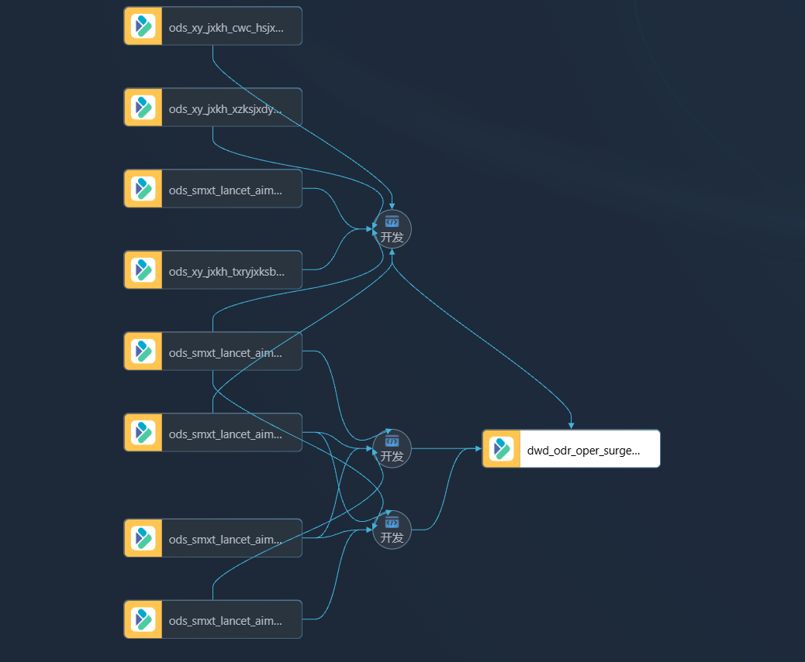

# dwd层建表语句清洗语句

| mysql原始表 | 数衍ods全量采集表（doris数据库） | 表名称 |
| --- | --- | --- |
| pat_surgery | ods_smxt_lancet_aims_pat_surgery_full_daily | 病人手术表 |
| pat_surgery_notice | ods_smxt_lancet_aims_pat_surgery_notice_full_daily | 病人手术通知表 |
| sys_dept | ods_smxt_lancet_aims_sys_dept_full_daily | 科室表 |
| sys_user | ods_smxt_lancet_aims_sys_user_full_daily | 医生人员表 |
|  | ods_xy_jxkh_v_ryb_full_daily | 绩效表 |
|  | ods_xy_jxkh_xzksjxdyb_full_daily | 绩效表 |
|  | ods_xy_jxkh_txryjxksb_full_daily | 绩效表 |
|  | ods_xy_jxkh_cwc_hsjxdyb_full_daily | 绩效表 |

1）ods表名称

#### 2）清洗表名称： dwd_odr_oper_surgery_records_full_hourly

#### 1建表语句

```sql
CREATE TABLE `doris_prod`. dwd_odr_oper_surgery_records_full_hourly (
`surgery_id` VARCHAR(255) NOT NULL COMMENT '手术id' ,
`zyh` VARCHAR(100) NULL COMMENT '住院号' ,
`xm` VARCHAR(255) NULL COMMENT '姓名' ,
`xb` VARCHAR(255) NULL COMMENT '性别' ,
`nl` VARCHAR(255) NULL COMMENT '年龄' ,
`szks` VARCHAR(255) NULL COMMENT '患者所在科室' ,
`sqkk` VARCHAR(255) NULL COMMENT '医生所在科室' ,
`ch` VARCHAR(255) NULL COMMENT '床号' ,
`surgery_type` VARCHAR(255) NULL COMMENT '手术类型' ,
`ssmc` VARCHAR(500) NULL COMMENT '手术名称' ,
`sqzd` VARCHAR(255) NULL COMMENT '术前诊断' ,
`yblx` VARCHAR(255) NULL COMMENT '医保类型' ,
`sqsj` VARCHAR(255) NULL COMMENT '手术申请时间' ,
`ssrq` VARCHAR(255) NULL COMMENT '手术日期' ,
`rssj` VARCHAR(255) NULL COMMENT '入手术间时间' ,
`cssj` VARCHAR(255) NULL COMMENT '出手术间时间' ,
`sskssj` VARCHAR(255) NULL COMMENT '手术开始时间' ,
`ssjssj` VARCHAR(255) NULL COMMENT '手术结束时间' ,
`mzkssj` VARCHAR(255) NULL COMMENT '麻醉开始时间' ,
`mzjssj` VARCHAR(255) NULL COMMENT '麻醉结束时间' ,
`sszt` VARCHAR(255) NULL COMMENT '手术状态' ,
`mzfs` VARCHAR(255) NULL COMMENT '麻醉方法' ,
`sssmc` VARCHAR(255) NULL COMMENT '手术室名称',
`zdks_id` VARCHAR(255) NULL COMMENT '主刀科室id',
`zdks_mc` VARCHAR(255) NULL COMMENT '主刀科室名称',
`ssj` VARCHAR(255) NULL COMMENT '手术间' ,
`tc` VARCHAR(255) NULL COMMENT '台次' ,
`surgery_doctor_name` VARCHAR(255) NULL COMMENT '主刀医生名称' ,
`surgery_doctor_id` VARCHAR(255) NULL COMMENT '主刀医生id' ,
`circuit_nurse1_name` VARCHAR(255) NULL COMMENT '巡回护士姓名' ,
`equipment_nurse1_name` VARCHAR(255) NULL COMMENT '器械护士姓名' ,
`anes_doctor1_name` VARCHAR(255) NULL COMMENT '麻醉医生姓名' ,
`doctor_sync_id` VARCHAR(255) NULL COMMENT '麻醉医生id' ,
`mzzs` VARCHAR(255) NULL COMMENT '麻醉助手' ,
`visit_id` VARCHAR(255) NULL COMMENT '' ,
`sync_id` VARCHAR(255) NULL COMMENT '' ,
`hzid` VARCHAR(255) NULL COMMENT '' ,
`surgery_level` VARCHAR(255) NULL COMMENT '手术级别' ,
`jxks` VARCHAR(255) NULL COMMENT '绩效科室' ,
`jxks_sync_id` VARCHAR(255) NULL COMMENT '绩效科室id' ,
`etl_time` VARCHAR(255) NULL COMMENT '',
`jxks1` VARCHAR(255) NULL COMMENT '绩效科室id',
`modify_time` VARCHAR(255) NULL COMMENT '修改时间'
)
ENGINE=olap
UNIQUE KEY(surgery_id)
COMMENT '手术麻醉大屏表'
DISTRIBUTED BY HASH(surgery_id) BUCKETS 3
```

# 2清洗语句

```sql
insert into
  dwd_odr_oper_surgery_records_full_hourly
select
  ps.ID AS surgery_id,
  IFNULL (ps.ADMISSION_NUMBER, '') AS zyh,
  IFNULL (ps.NAME, '') AS xm,
  IFNULL (ps.GENDER, '') AS xb,
  IFNULL (ps.AGE, 0) AS nl,
  IFNULL (ps.DEPT_NAME, '') AS szks,
  IFNULL (ad.NAME, '') AS sqkk,
  IFNULL (ps.BED_NUMBER, '') AS ch,
  CASE ps.TYPE
    WHEN 1 THEN '择期手术'
    WHEN 2 THEN '急诊手术'
    WHEN 3 THEN '门诊手术'
    WHEN 4 THEN '技诊手术'
    WHEN 5 THEN '择期手术'
    WHEN 6 THEN '科外业务'
    WHEN 7 THEN '急诊手术'
    WHEN 8 THEN '体检手术'
    WHEN 9 THEN '预留手术'
    WHEN 10 THEN '加台手术'
    ELSE ''
  END AS surgery_type,
  IFNULL (ps.surgery_name, '') AS ssmc,
  IFNULL (ps.DIAGNOSIS_CONTENT, '') AS sqzd,
  null AS yblx,
  ps.APPLY_TIME AS sqsj,
  ps.SURGERY_DATE AS ssrq,
  ps.surgery_entry_time AS rssj,
  ps.surgery_leave_time AS cssj,
  ps.surgery_begin_time AS sskssj,
  ps.surgery_end_time AS ssjssj,
  ps.anes_begin_time AS mzkssj,
  ps.anes_end_time AS mzjssj,
  IFNULL (ps.STATE, '') AS sszt,
  IFNULL (ps.ANES_TYPE_NAME, '') AS mzfs,
  CASE
    WHEN ps.OR_DEPT_NAME = '一期中心手术室(南区)' THEN '中心手术室(南区一期)'
    WHEN ps.OR_DEPT_NAME = '中心手术室（南区二期）' THEN '中心手术室(南区二期)'
    ELSE IFNULL (ps.OR_DEPT_NAME, '')
  END AS sssmc,
  IFNULL (ps.doctor_dept_id, '') as zdks_id,
  IFNULL (ps.doctor_dept_name, '') as zdks_mc,
  IFNULL (ps.ROOM_NAME, '') AS ssj,
  IFNULL (ps.SURGERY_SERIAL, '') AS tc,
  IFNULL (ps.surgery_doctor_name, '') AS surgery_doctor_name,
  IFNULL (ps.surgery_doctor_id, '') AS surgery_doctor_id,
  IFNULL(CONCAT_WS('、', ps.circuit_nurse1_name, ps.circuit_nurse2_name), '') AS circuit_nurse1_name,
    IFNULL(CONCAT_WS('、', ps.equipment_nurse1_name, ps.equipment_nurse2_name), '') AS equipment_nurse1_name,
    IFNULL(CONCAT_WS('、', ps.anes_doctor1_name, ps.anes_doctor2_name), '') AS anes_doctor1_name,
  su.sync_id as doctor_sync_id,
  CASE
    WHEN ps.anes_assistant IS NOT NULL
    AND ps.anes_assistant NOT IN ('', 'null')
    AND JSON_VALID (ps.anes_assistant) THEN JSON_UNQUOTE (
      JSON_EXTRACT_string (ps.anes_assistant, '$[0].name')
    )
    ELSE ''
  END AS mzzs,
  null AS visit_id,
  null AS sync_id,
  null AS hzid,
  CASE
    WHEN LOCATE ('Ⅳ级', ps.SURGERY_LEVEL) > 0 THEN 'Ⅳ级'
    WHEN LOCATE ('Ⅲ级', ps.SURGERY_LEVEL) > 0 THEN 'Ⅲ级'
    WHEN LOCATE ('Ⅱ级', ps.SURGERY_LEVEL) > 0 THEN 'Ⅱ级'
    WHEN LOCATE ('Ⅰ级', ps.SURGERY_LEVEL) > 0 THEN 'Ⅰ级'
    ELSE '未知'
  END AS surgery_level,
  bb.jxks as jxks,
  ad.sync_id as jxks_sync_id,
  now () as etl_time,
  COALESCE(ee.jxksmc, dd.jxksmc) as jxks1,
  ps.modify_time as modify_time
FROM
  ods_smxt_lancet_aims_pat_surgery_full_daily ps
    LEFT JOIN ods_smxt_lancet_aims_pat_surgery_notice_full_daily psn ON psn.PATIENT_ID = ps.PATIENT_ID
  LEFT JOIN ods_smxt_lancet_aims_sys_dept_full_daily ad ON ad.ID = psn.APPLY_DEPT_ID
  LEFT JOIN ods_xy_jxkh_cwc_hsjxdyb_full_daily bb ON ad.sync_id = bb.ksbm

  LEFT JOIN ods_smxt_lancet_aims_sys_user_full_daily su on ps.doctor_dept_id = su.dept_id
  and ps.surgery_doctor_id = su.id
  LEFT join ods_xy_jxkh_v_ryb_full_daily cc on su.sync_id = cc.ygbh
  LEFT join ods_xy_jxkh_xzksjxdyb_full_daily dd on cc.xzksbh = dd.xzksbh
  LEFT join ods_xy_jxkh_txryjxksb_full_daily ee on ee.ygbh = su.sync_id
WHERE
  ps.VALID = 1
  AND ps.IS_TRANSFER_ROOM = 0
```

## 3 血缘图



> 另一张「数据血缘」页面截图（含节点详情面板）因包含客户方空间名与真实创建人姓名，
> 不随仓库分发，见 [data/README.md](data/README.md)。
